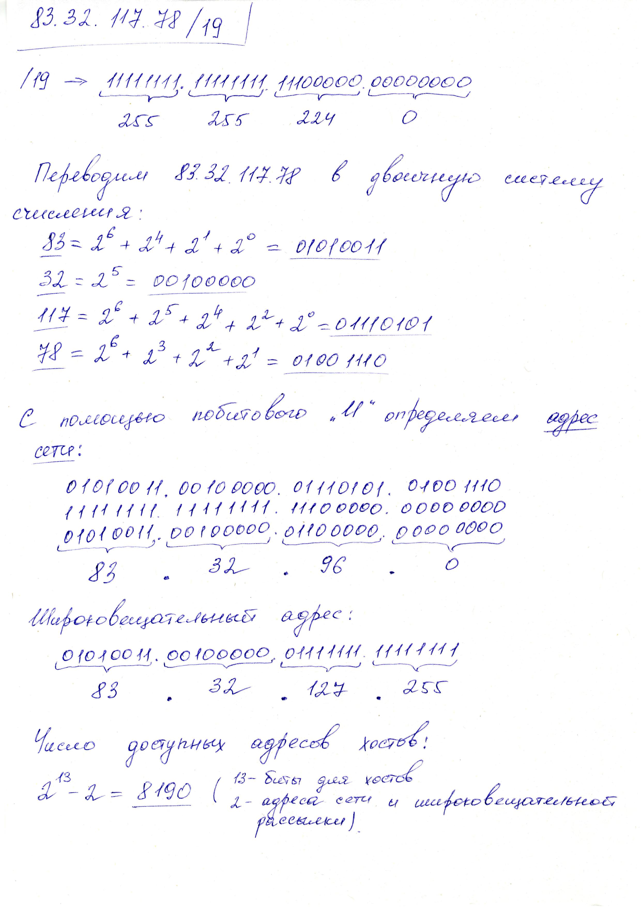
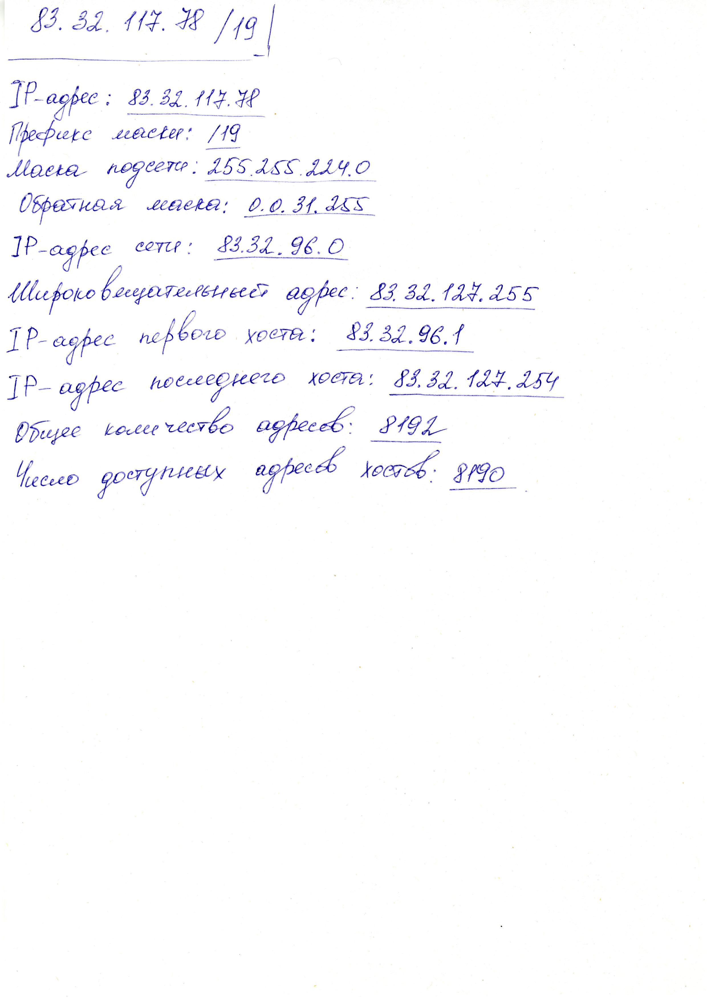
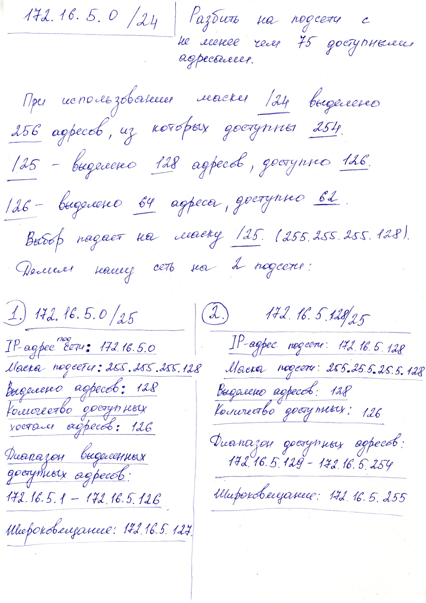

### ***1. Расчет сети по адресу и маске***

```
83.32.117.78/19
```




### ***2. Деление сети на подсети***

_Условие:_ Имеется сеть `172.16.5.0/24`, разбить на подсети с не менее чем 75 доступными адресами.

