1. Создаем и наполняем репозиторий файлами и коммитами:

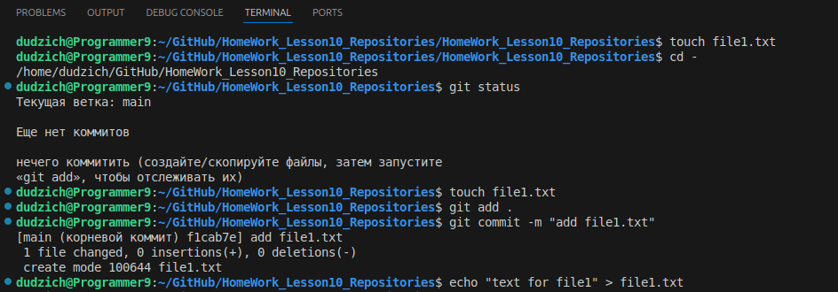
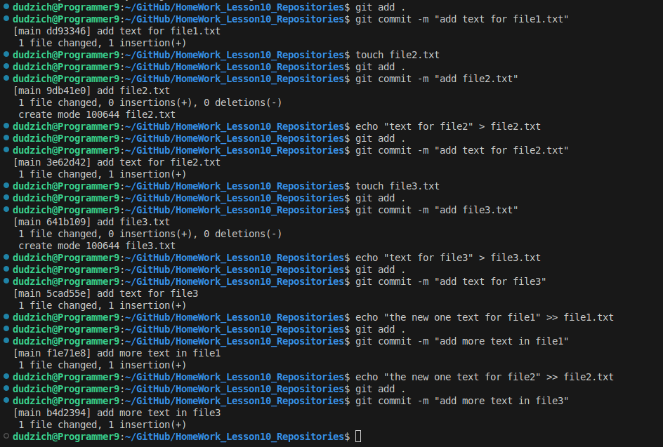

Лог коммитов выглядит следующим образом:
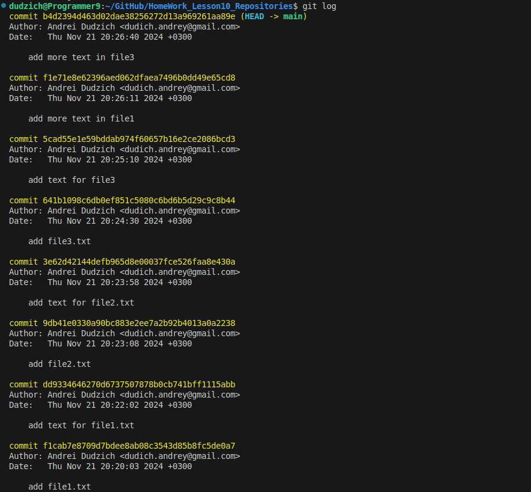
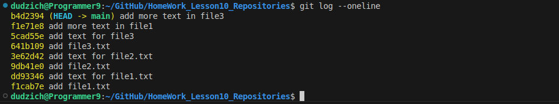

2. Проверяем хэши коммитов командой `git reflog` и переходим на интересующий нас коммит `git checkout <хэш>`:

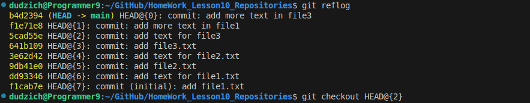

Возвращаемся обратно командой `git checkout main`:

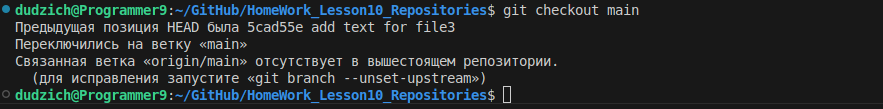

3. Создаем новую ветку `develop`:

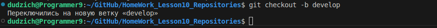

4. Изменяем предыдущий коммит с помощью атрибута `amend`:

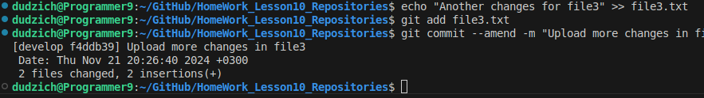

5. Делаепм коммит в `main`, но не пушим изменения в удаленный репозиторий:

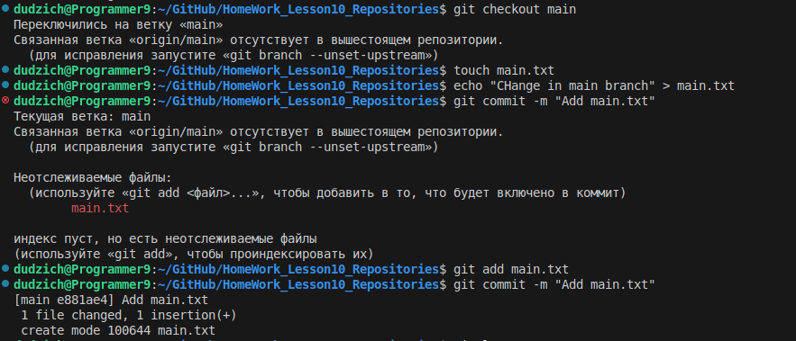

6. Переносим коммит в новую ветку с помощью `git reset --hard`:

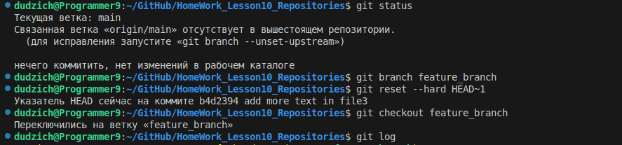

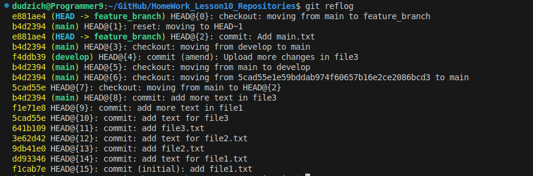

7. Сделаем изменения и отменим их через `git checkout`:

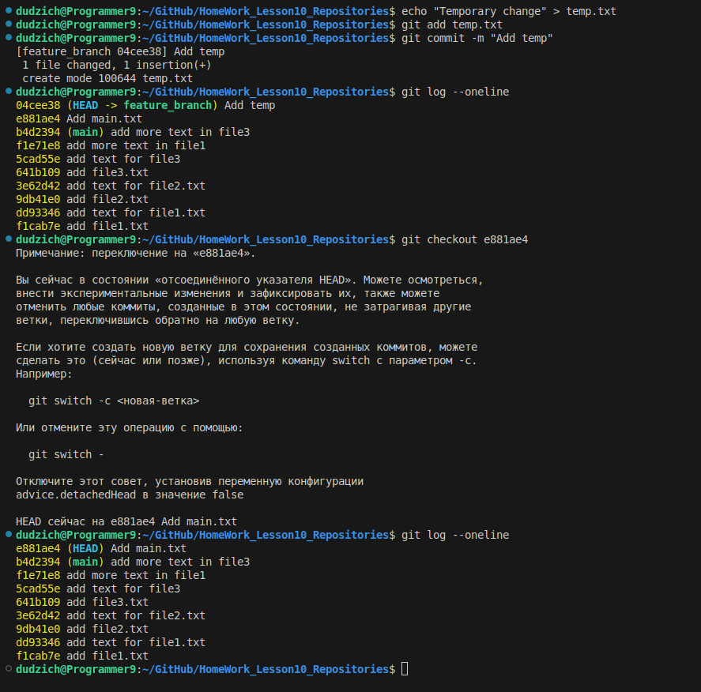