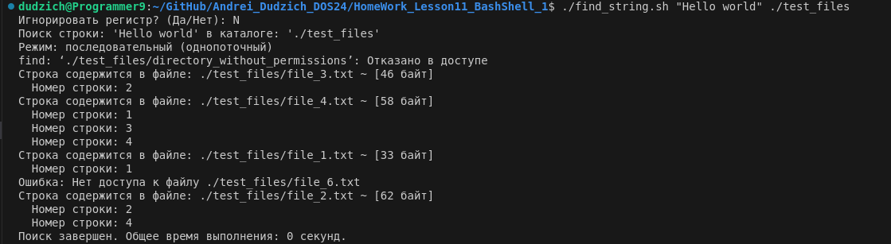

### 1. ***Поиск файлов по расширению***

**Цель задания:** Написать bash-скрипт, который находит все файлы с заданным расширением в указанном каталоге и записывает их имена в указанный выходной файл.

**Описание решения:**

Разработан bash-скрипт `find_files.sh`, который принимает три аргумента:

1. **`<output_file>`:**  Имя выходного файла, в который будут записаны имена найденных файлов.
2. **`<directory>`:** Путь к каталогу, в котором будет осуществляться поиск.
3. **`[extension]`:** (Необязательный) Расширение файлов для поиска (без точки). Если не указан, скрипт найдёт файлы без расширения.

Скрипт выполняет следующие действия:

1. **Проверка аргументов:** Проверяет наличие достаточного количества аргументов и корректность указанного пути к каталогу.
2. **Проверка существования файла:** Проверяет, существует ли уже файл с указанным именем. Если да, выводит сообщение об ошибке.
3. **Проверка прав доступа:** Проверяет права на чтение в указанном каталоге и права на запись в текущий каталог для создания выходного файла.
4. **Поиск файлов:** Использует команду `find` для поиска файлов с указанным расширением (или без расширения, если аргумент не задан).
5. **Запись результатов:** Записывает имена найденных файлов в выходной файл.
6. **Вывод сообщения:** Выводит сообщение об успешном завершении или об ошибке, включая информацию о количестве найденных файлов и их расширении.

**Обработка ошибок:**

Скрипт обрабатывает следующие ошибки:

* Недостаточно аргументов командной строки.
* Каталог не существует или недоступен для чтения.
* Невозможно создать выходной файл (например, из-за отсутствия прав доступа).
* Файл с именем выходного файла уже существует.
* Ошибки при выполнении команды `find`.


**Листинг кода:**
```Bash
#!/bin/bash

# Проверка аргументов
if [ "$#" -lt 2 ]; then
    echo "Ошибка: Недостаточно аргументов. Использование: $0 <output_file> <directory> [extension]"
    exit 1
fi

output_file="$1"
directory="$2"
extension="$3"

# Проверка существования и прав доступа к директории
if [ ! -d "$directory" ]; then
    echo "Ошибка: Каталог '$directory' не существует."
    exit 1
fi

if [ ! -r "$directory" ]; then
    echo "Ошибка: Нет прав на чтение каталога '$directory'."
    exit 1
fi

# Проверка существования выходного файла и возможности записи
if [ -f "$output_file" ]; then
    echo "Ошибка: Файл '$output_file' уже существует. Переименуйте файл или удалите его."
    exit 1
elif ! touch "$output_file" 2>/dev/null; then
    echo "Ошибка: Невозможно создать файл '$output_file'. Проверьте права доступа."
    exit 1
fi

# Поиск файлов
if [ -z "$extension" ]; then
    find_command="find \"$directory\" -type f ! -name '*.*'"
else
  extension="${extension/#./}" # Удаляем точку, если она есть
  find_command="find \"$directory\" -type f -name \"*.$extension\""
fi

find_result=$(eval "$find_command" 2>&1)
status=$?

# Обработка результатов поиска
if [ $status -eq 0 ]; then
    echo "$find_result" > "$output_file"
    if [ -s "$output_file" ]; then
        echo "Имена файлов${extension:+ с расширением .$extension} из каталога '$directory' записаны в файл '$output_file'."
    else
        echo "В каталоге '$directory' не найдено файлов${extension:+ с расширением .$extension}."
    fi
else
    echo "Ошибка при выполнении команды find: $find_result"
    exit 1
fi

echo "Скрипт завершён."
exit 0
```

### 2. ***Поиск строки в файлах указанной директории***

**Цель задания:** Написать bash-скрипт для поиска заданной строки во всех файлах указанного каталога и его подкаталогах. Строка и имя каталога задаются пользователем в качестве первого и второго аргумента командной строки. На консоль выводятся полный путь и имена файлов, в содержимом которых присутствует заданная строка, а также их размер. Если к какому-либо каталогу нет доступа, необходимо вывести соответствующее сообщение и продолжить выполнение.

**Описание решения:**

Разработан bash-скрипт `search_string.sh`, который принимает следующие аргументы:

1. **`<search_string>`:** Строка, которую необходимо найти в файлах.
2. **`<directory>`:** Путь к каталогу, в котором будет осуществляться поиск.
3. **`[mode]`:** (Необязательный) Режим поиска. По умолчанию используется режим `-default` (однопоточный). Если задан параметр `-force`, поиск выполняется в многопоточном режиме.

Скрипт выполняет следующие действия:

1. **Проверка аргументов:** Скрипт проверяет наличие достаточного количества аргументов командной строки и корректность указанного каталога.
2. **Проверка пустоты строки поиска:** Проверяется, что строка поиска не пуста.
3. **Проверка существования каталога:** Убедитесь, что указанный каталог существует и доступен.
4. **Запрос режима работы:** Пользователь выбирает режим, в котором будет выполняться поиск (однопоточный или многопоточный).
5. **Запрос игнорирования регистра:** Скрипт спрашивает, нужно ли игнорировать регистр при поиске строки.
6. **Поиск строк в файлах:** Используется команда `grep` для поиска строки в файлах. В режиме `-force` используется многопоточный подход с помощью команды `xargs`.
7. **Вывод информации:** Для каждого найденного файла выводится его имя, размер и номер строки, в которой найдена строка. Если файл не доступен, выводится сообщение об ошибке.
8. **Время выполнения:** После завершения поиска выводится общее время выполнения.

**Обработка ошибок:**

* Недостаточно аргументов командной строки: Если не указаны строка поиска или каталог, скрипт выводит сообщение о неправильном использовании.
* Пустая строка поиска: Если строка поиска пуста, скрипт сообщает об ошибке.
* Невозможность доступа к каталогу: Если каталог не существует или недоступен, скрипт выводит ошибку.
* Неверно указан режим: Если задан неверный режим, выводится сообщение о корректных вариантах.
* Отказ в доступе к файлу: Если файл недоступен для чтения, скрипт уведомляет об этом.

Создаём тестовую папку с текстовыми файлами и директорией с помощью скрипта `create_hello_files.sh`, где закрыт доступ на чтения для файла `file_6.txt` и директории `directory_without_permissions`:


**Поиск строки `Hello world` в директории `test_files` в однопоточном режиме с игнорированием регистра:**


**Поиск строки `Hello world` в директории `test_files` в однопоточном режиме без игнорирования регистра:**


**Поиск строки `Hello world` в директории `test_files` в многопоточном режиме с игнорированием регистра:**


**Поиск строки `Hello world` в директории `test_files` в многопоточном режиме без игнорирования регистра:**


Создаем подкатолог `directory_with_permissions` в каталоге `test_files`, наполняем его файлами с искомой строкой и запускаем проверку:


Убеждаемся, что скрипт производит поиск и по подкаталогам.

***Листинг:***

```Bash
#!/bin/bash

# Аргументы
search_string="$1"
directory="$2"
mode="${3:--default}"  # Если режим не указан, устанавливается -default

# Проверка наличия аргументов: строка поиска и каталог
if [ $# -lt 2 ]; then
  echo "Использование: $0 <строка_для_поиска> <каталог> [-force/-default]"
  exit 1
fi

# Проверка на пустую строку поиска
if [ -z "$search_string" ]; then
  echo "Ошибка: Строка для поиска не может быть пустой."
  exit 1
fi

# Проверка существования каталога
if [ ! -d "$directory" ]; then
  echo "Ошибка: Каталог '$directory' не существует или недоступен."
  exit 1
fi

# Проверка выбора режима
if [[ "$mode" != "-default" && "$mode" != "-force" ]]; then
  echo "Ошибка: Укажите корректный режим -default (однопоточный) или -force (многопоточный)."
  exit 1
fi

# Запрос о игнорировании регистра
while true; do
  read -p "Игнорировать регистр? (Да/Нет): " ignore_case_answer
  ignore_case_answer=$(echo "$ignore_case_answer" | tr '[:upper:]' '[:lower:]')
  if [[ "$ignore_case_answer" =~ ^(Да|да|Д|д|Yes|yes|Y|y|\+)$ ]]; then
    grep_option="-i"
    break
  elif [[ "$ignore_case_answer" =~ ^(Нет|нет|Н|н|No|no|N|n|\-)$ ]]; then
    grep_option=""
    break
  else
    echo "Ошибка: Неверный ввод."
  fi
done

echo "Поиск строки: '$search_string' в каталоге: '$directory'"

if [ "$mode" == "-default" ]; then
  echo "Режим: последовательный (однопоточный)"
else
  echo "Режим: параллельный (многопоточный)"
fi

start_time=$(date +%s)

if [ "$mode" == "-default" ]; then
  find "$directory" -type f -print0 | while IFS= read -r -d $'\0' file; do
    if [[ -r "$file" ]]; then
      matches=$(grep -n --binary-files=without-match $grep_option "$search_string" "$file")
      if [[ -n "$matches" ]]; then
        size=$(stat -c "%s" "$file")
        echo "Строка содержится в файле: $file ~ [$size байт]"
        echo "$matches" | while IFS= read -r line; do
          line_number=$(echo "$line" | cut -d':' -f1)
          echo "  Номер строки: $line_number"
        done
      fi
    else
      echo "Ошибка: Нет доступа к файлу $file"
    fi
  done

elif [ "$mode" == "-force" ]; then
  cpu_threads=$(nproc) # Используем все ядра
  export search_string grep_option
  find "$directory" -type f -print0 | xargs -0 -n 1 -P "$cpu_threads" bash -c '
    file="$1"
    if [[ -r "$file" ]]; then
      matches=$(grep -n --binary-files=without-match $grep_option "$search_string" "$file")
      if [[ -n "$matches" ]]; then
        size=$(stat -c "%s" "$file")
        echo "Строка содержится в файле: $file ~ [$size байт]"
        echo "$matches" | while IFS= read -r line; do
          line_number=$(echo "$line" | cut -d":" -f1)
          echo "  Номер строки: $line_number"
        done
      fi
    else
      echo "Ошибка: Нет доступа к файлу $file"
    fi
  ' _
fi

end_time=$(date +%s)
elapsed_time=$((end_time - start_time))

echo "Поиск завершен. Общее время выполнения: $elapsed_time секунд."
exit 0
```


