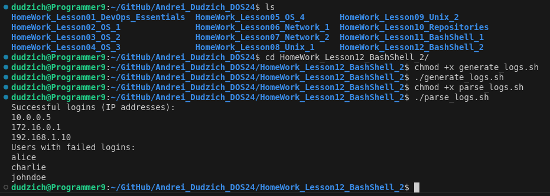

## Отчет по заданию

### Описание задачи
Необходимо обработать лог-файл сервера и:
1. Найти все IP-адреса, с которых произошел успешный вход (код ответа `200`).
2. Найти всех уникальных пользователей, которые пытались авторизоваться, но получили ошибку (код ответа `403`).

### Исходные данные
Пример логов:
`2024-11-26 12:30:15 [INFO] user=johndoe ip=192.168.1.10 status=200`
`2024-11-26 12:31:03 [INFO] user=alice ip=10.0.0.5 status=403`
`2024-11-26 12:35:42 [INFO] user=bob ip=172.16.0.1 status=200`
`2024-11-26 12:36:00 [INFO] user=johndoe ip=192.168.1.10 status=403`
`2024-11-26 12:40:22 [INFO] user=charlie ip=10.0.0.8 status=403`
`2024-11-26 12:42:10 [INFO] user=alice ip=10.0.0.5 status=200`

### Реализация

```Bash
#!/bin/bash

# Лог-файл
LOGFILE="${1:-server.log}"

# Проверка существования файла
if [[ ! -f "$LOGFILE" ]]; then
    echo "Error: Log file '$LOGFILE' not found."
    exit 1
fi

# Проверка на пустоту
if [[ ! -s "$LOGFILE" ]]; then
    echo "Error: Log file '$LOGFILE' is empty."
    exit 1
fi

# Успешные входы (IP-адреса)
SUCCESSFUL_IPS=$(grep -E "user=[^ ]+ ip=[^ ]+ status=200" "$LOGFILE" | awk -F'ip=' '{print $2}' | awk '{print $1}' | sort | uniq)
if [[ -z "$SUCCESSFUL_IPS" ]]; then
    echo "No successful logins found."
else
    echo "Successful logins (IP addresses):"
    echo "$SUCCESSFUL_IPS"
fi

# Ошибки авторизации (уникальные пользователи)
FAILED_USERS=$(grep -E "user=[^ ]+ ip=[^ ]+ status=403" "$LOGFILE" | awk -F'user=' '{print $2}' | awk '{print $1}' | sort | uniq)
if [[ -z "$FAILED_USERS" ]]; then
    echo "No failed logins found."
else
    echo "Users with failed logins:"
    echo "$FAILED_USERS"
fi

```

### Пояснение

Поиск строк с status=200:

* `grep -E "user=[^ ]+ ip=[^ ]+ status=200" "$LOGFILE"` - использует регулярное выражение для поиска строк, содержащих:
    * `user=` - за которым идет имя пользователя;
    * `ip=` - за которым идет IP-адрес;
    * `status=200` - что указывает на успешный вход.
* `awk -F'ip=' '{print $2}'` - разделяет строку по ip= и берёт часть после неё (где находится IP).
* `awk '{print $1}'` - убирает всё после IP-адреса.
* `sort | uniq` - удаляет дубликаты.

Поиск строк с status=403:

* `grep -E "user=[^ ]+ ip=[^ ]+ status=403" "$LOGFILE"` - использует регулярное выражение для поиска строк, содержащих:
    * `user=` - за которым идет имя пользователя;
    * `ip=` - за которым идет IP-адрес;
    * `status=403` - что указывает на ошибку авторизации.
* `awk -F'user=' '{print $2}'` - извлекает часть после user=.
* `awk '{print $1}'` - убирает всё после имени пользователя.
* `sort | uniq` - удаляет дубликаты имён.

В данном скрипте реализованы следующие обработчики ошибок:

**1. Проверка существования лог-файла:**

* Если указанный лог-файл не существует, выводится сообщение об ошибке: `Error: Log file '$LOGFILE' not found.`. Скрипт завершает выполнение с кодом ошибки `exit 1`.

**2. Проверка на пустоту лог-файла:**

* Если лог-файл пустой (имеет нулевой размер), выводится сообщение: `Error: Log file '$LOGFILE' is empty.`. Скрипт завершает выполнение с кодом ошибки `exit 1`.

**3. Отсутствие успешных входов:**

* Если в лог-файле не найдено записей с успешными входами (IP-адресами), выводится сообщение: `No successful logins found.`.

**4. Отсутствие неудачных попыток авторизации:**

* Если не найдено пользователей с неудачными попытками входа, выводится сообщение: `No failed logins found.`.

Эти проверки позволяют обработать ситуации, когда файл отсутствует, пуст, или в нем нет нужных данных.

### Вывод результата

Скрипт выводит два списка: IP-адресов с успешными входами и имён пользователей с ошибкой входа.


