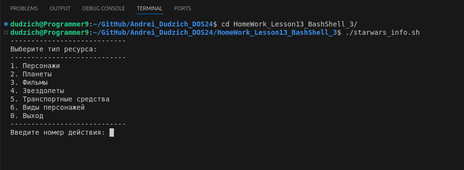
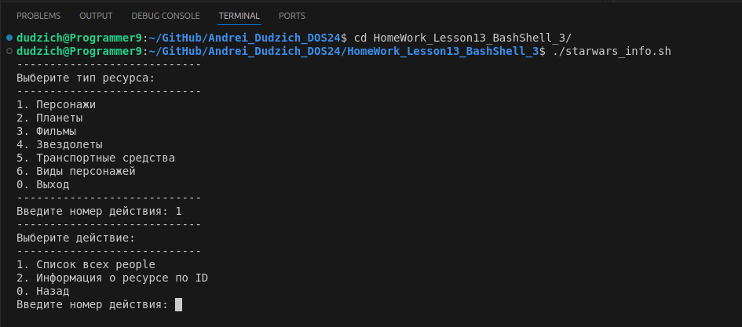
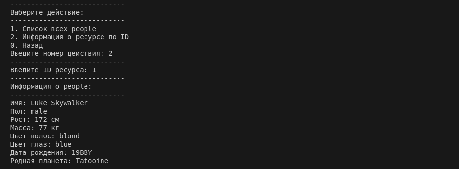

### Задание:

1. Через функцию составить запрос к API, получить данные.
2. Составить функцию, которая будет забирать данные вашего запроса и представлять их в читаемом виде. После того как вы запишите это в виде скрипта, запустите его, вы сможете вызывать вашу функцию наподобие командлета.
3. Добавить один  (*два) входных параметра (абсолютно любой, например, название города для сервиса погоды либо номера страницы из массива персонажей)

### Реализация:

Скрипт `starwars_info.sh` взаимодействует с API Star Wars (https://swapi.dev/) для получения информации о персонажах, планетах, фильмах и других ресурсах из вселенной "Звёздные войны".

***1. Основные функции***

`get_starwars_data()` - Принимает URL в качестве аргумента. Выполняет HTTP-запрос к API с помощью команды curl и возвращает ответ в формате JSON.

`get_all_resources()` - Принимает название ресурса (например, `people`, `planets`, `films`) и запрашивает данные по указанному ресурсу через API.Извлекает общее количество объектов (`count`) и перечисляет их имена/названия (`name` или `title`). Для каждого объекта выводит его ID и название.

`get_resource_by_id()` - Принимает название ресурса и его ID. Запрашивает подробную информацию об объекте через API. В зависимости от типа ресурса (например, `персонаж`, `планета`, `фильм`) извлекает и отображает соответствующие данные:
* Для `персонажей`: имя, пол, рост, масса, цвет волос/глаз, дата рождения, родная планета.
* Для `планет`: название, диаметр, климат, тип местности, население.
* Для `фильмов`: название, режиссёр, продюсер, дата выхода.
* Для `звездолётов` и `транспортных средств`: название, модель, производитель, стоимость, длина, экипаж, пассажиры.
* Для `видов персонажей`: название, классификация, средний рост, цвет кожи/волос/глаз, средняя продолжительность жизни.

***2. Основное меню***
После запуска скрипт предоставляет меню выбора ресурса:

* `Персонажи` (`people`)
* `Планеты` (`planets`)
* `Фильмы` (`films`)
* `Звездолёты` (`starships`)
* `Транспортные средства` (`vehicles`)
* `Виды персонажей` (`species`)
* `Выход`

Пользователь вводит номер, соответствующий ресурсу, который его интересует.



***3. Подменю действий для выбранного ресурса***

После выбора типа ресурса появляется второе меню с действиями:

* `Список всех ресурсов`:
Вызывает `get_all_resources()` для отображения списка всех объектов данного ресурса.
* `Информация о ресурсе по ID`:
Запрашивает у пользователя ID и вызывает `get_resource_by_id()` для получения подробной информации об объекте.
* `Назад`:
Возвращает пользователя в основное меню.







***Листинг:***

```Bash

#!/bin/bash

# Функция для выполнения GET запроса к API
get_starwars_data() {
    url=$1
    response=$(curl -s "$url")
    echo "$response"
}

# Функция для вывода всех ресурсов с заданным URL
get_all_resources() {
    resource_name=$1
    url="https://swapi.dev/api/$resource_name/"
    response=$(get_starwars_data "$url")
    total_results=$(echo "$response" | jq '.count')

    echo "Список всех $resource_name:"

    for i in $(seq 1 $total_results); do
        id=$(echo "$response" | jq -r ".results[$i-1].url" | awk -F'/' '{print $(NF-1)}')
        name=$(echo "$response" | jq -r ".results[$i-1].name // .results[$i-1].title")

        # Фильтрация пустых значений
        if [[ -z "$name" || "$name" == "null" ]]; then
            continue
        fi

        echo "ID: $id - Название: $name"
        
    done
}


# Функция для получения информации о ресурсе по ID
get_resource_by_id() {
    resource_name=$1
    resource_id=$2
    url="https://swapi.dev/api/$resource_name/$resource_id/"
    response=$(get_starwars_data "$url")

    if [ -z "$response" ]; then
        echo "$resource_name с ID $resource_id не найден."
        return
    fi

    echo "----------------------------"
    echo "Информация о $resource_name:"
    case $resource_name in
        people)
            name=$(echo "$response" | jq -r '.name')
            gender=$(echo "$response" | jq -r '.gender')
            height=$(echo "$response" | jq -r '.height')
            mass=$(echo "$response" | jq -r '.mass')
            hair_color=$(echo "$response" | jq -r '.hair_color')
            eye_color=$(echo "$response" | jq -r '.eye_color')
            birth_year=$(echo "$response" | jq -r '.birth_year')
            homeworld_url=$(echo "$response" | jq -r '.homeworld')
            homeworld_name=$(get_starwars_data "$homeworld_url" | jq -r '.name')

            echo "----------------------------"
            echo "Имя: $name"
            echo "Пол: $gender"
            echo "Рост: $height см"
            echo "Масса: $mass кг"
            echo "Цвет волос: $hair_color"
            echo "Цвет глаз: $eye_color"
            echo "Дата рождения: $birth_year"
            echo "Родная планета: $homeworld_name"
            ;;
        planets)
            name=$(echo "$response" | jq -r '.name')
            diameter=$(echo "$response" | jq -r '.diameter')
            gravity=$(echo "$response" | jq -r '.gravity')
            climate=$(echo "$response" | jq -r '.climate')
            terrain=$(echo "$response" | jq -r '.terrain')
            population=$(echo "$response" | jq -r '.population')

            echo "----------------------------"
            echo "Название: $name"
            echo "Диаметр: $diameter км"
            echo "Гравитация: $gravity"
            echo "Климат: $climate"
            echo "Тип местности: $terrain"
            echo "Население: $population"
            ;;
        films)
            title=$(echo "$response" | jq -r '.title')
            director=$(echo "$response" | jq -r '.director')
            producer=$(echo "$response" | jq -r '.producer')
            release_date=$(echo "$response" | jq -r '.release_date')

            echo "----------------------------"
            echo "Название: $title"
            echo "Режиссёр: $director"
            echo "Продюсер: $producer"
            echo "Дата выхода: $release_date"
            ;;
        starships | vehicles)
            name=$(echo "$response" | jq -r '.name')
            model=$(echo "$response" | jq -r '.model')
            manufacturer=$(echo "$response" | jq -r '.manufacturer')
            cost_in_credits=$(echo "$response" | jq -r '.cost_in_credits')
            length=$(echo "$response" | jq -r '.length')
            crew=$(echo "$response" | jq -r '.crew')
            passengers=$(echo "$response" | jq -r '.passengers')

            echo "----------------------------"
            echo "Название: $name"
            echo "Модель: $model"
            echo "Производитель: $manufacturer"
            echo "Стоимость: $cost_in_credits кредитов"
            echo "Длина: $length м"
            echo "Экипаж: $crew"
            echo "Пассажиры: $passengers"
            ;;
        species)
            name=$(echo "$response" | jq -r '.name')
            classification=$(echo "$response" | jq -r '.classification')
            designation=$(echo "$response" | jq -r '.designation')
            average_height=$(echo "$response" | jq -r '.average_height')
            skin_colors=$(echo "$response" | jq -r '.skin_colors')
            hair_colors=$(echo "$response" | jq -r '.hair_colors')
            eye_colors=$(echo "$response" | jq -r '.eye_colors')
            average_lifespan=$(echo "$response" | jq -r '.average_lifespan')

            echo "----------------------------"
            echo "Название: $name"
            echo "Классификация: $classification"
            echo "Назначение: $designation"
            echo "Средний рост: $average_height см"
            echo "Цвета кожи: $skin_colors"
            echo "Цвета волос: $hair_colors"
            echo "Цвета глаз: $eye_colors"
            echo "Средняя продолжительность жизни: $average_lifespan лет"
            ;;
        *)
            echo "Детальная информация для ресурса '$resource_name' не поддерживается."
            ;;
    esac
}

# Меню выбора типа ресурса
while true; do
    echo "----------------------------"
    echo "Выберите тип ресурса:"
    echo "----------------------------"
    echo "1. Персонажи"
    echo "2. Планеты"
    echo "3. Фильмы"
    echo "4. Звездолеты"
    echo "5. Транспортные средства"
    echo "6. Виды персонажей"
    echo "0. Выход"
    echo "----------------------------"
    read -p "Введите номер действия: " choice
    

    case $choice in
        1)
            resource_type="people"
            ;;
        2)
            resource_type="planets"
            ;;
        3)
            resource_type="films"
            ;;
        4)
            resource_type="starships"
            ;;
        5)
            resource_type="vehicles"
            ;;
        6)
            resource_type="species"
            ;;
        0)
            echo "----------------------------"
            echo "Выход из программы."
            exit 0
            ;;
        *)
            echo "----------------------------"
            echo "Неверный выбор. Попробуйте снова."
            continue
            ;;
    esac

    # Меню с действиями для выбранного ресурса
    while true; do
        echo "----------------------------"
        echo "Выберите действие:"
        echo "----------------------------"
        echo "1. Список всех $resource_type"
        echo "2. Информация о ресурсе по ID"
        echo "0. Назад"
        read -p "Введите номер действия: " action

        case $action in
            1)
                get_all_resources "$resource_type"
                ;;
            2)
                echo "----------------------------"
                read -p "Введите ID ресурса: " resource_id
                get_resource_by_id "$resource_type" "$resource_id"
                ;;
            0)
                echo "----------------------------"
                break  # Возвращаемся в основное меню
                ;;
            *)
                echo "----------------------------"
                echo "Неверный выбор. Попробуйте снова."
                ;;
        esac
    done

done

```