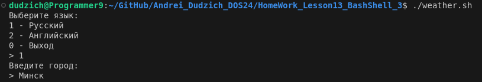
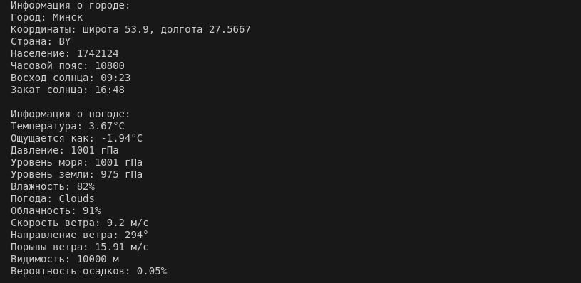

## Описание

Скрипт `weather.sh` предназначен для получения информации о погоде в указанном городе. Он использует API OpenWeatherMap для запроса данных и предоставляет пользователю возможность выбора языка интерфейса (русский или английский). После вывода информации о городе и погоде, скрипт предлагает пользователю продолжить или завершить работу.

## Функциональность

Скрипт выполняет следующие основные функции:

1.  **Выбор языка.** Пользователю предлагается выбрать язык интерфейса (русский или английский) с помощью интерактивного меню.
2.  **Ввод города.** После выбора языка пользователь вводит название города, для которого необходимо получить информацию о погоде.
3.  **Получение данных.** Скрипт отправляет запрос к API OpenWeatherMap с названием города и получает данные о погоде и городе в формате JSON.
4.  **Вывод данных.** Полученные данные выводятся на экран в форматированном виде. Вывод включает:
    *   Информацию о городе (название, координаты, страна, население, часовой пояс, время восхода и заката).
    *   Информацию о погоде (температура, ощущается как, давление, влажность, скорость ветра и другие параметры).
5.  **Продолжение или завершение.** После вывода данных пользователю предлагается продолжить работу (ввести новый город) или завершить скрипт.

## Использование

Для запуска скрипта необходимо выполнить команду:

```bash
./weather.sh
```

## Структура скрипта

Скрипт состоит из следующих основных частей:

1.  **Комментарии.** В начале скрипта находится блок комментариев с описанием его работы, принципов использования и примером.
2.  **Глобальные переменные.**
    *   `API_KEY`: API ключ для доступа к OpenWeatherMap.
    *   `TEXTS`: Ассоциативный массив для хранения текстовых сообщений на разных языках.
3.  **Функции.**
    *   `get_text()`: Функция для получения текстового сообщения по ключу с учетом выбранного языка.
    *   `fetch_data()`: Функция для получения данных о городе и погоде с помощью API и вывода их на экран.
    *   `choose_language()`: Функция для выбора языка интерфейса.
    *   `choose_city()`: Функция для ввода названия города.
4.  **Основной цикл.** Запускает скрипт в интерактивном режиме, вызывая функции для выбора языка, ввода города и обработки продолжения работы.

## Зависимости

*   `curl`: для выполнения HTTP запросов к API.
*   `jq`: для обработки JSON данных.
*   `date`: для преобразования времени восхода и заката в удобочитаемый формат.

## Примеры работы

### 1. Выбор русского языка и ввод города Минск



### 2. Вывод информации о городе и погоде



### 3. Выбор продолжения работы


### 4. Выбор завершения работы


Скрипт `weather.sh` предоставляет удобный и интерактивный интерфейс для получения информации о погоде. Он использует API, форматирует вывод и предлагает пользователю гибкость в выборе языка и городов. Скрипт прост в использовании и хорошо документирован, что делает его полезным инструментом для получения информации о погоде из командной строки.

