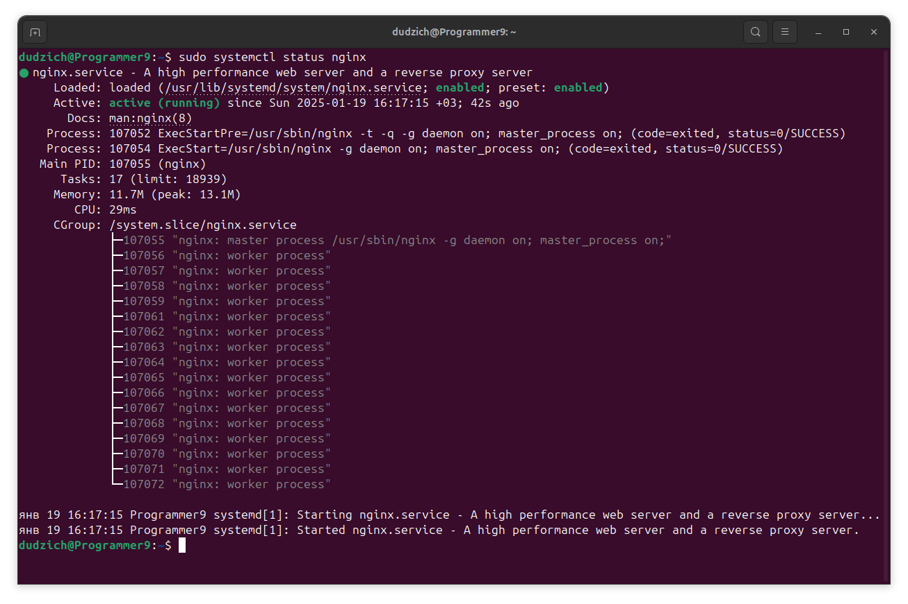
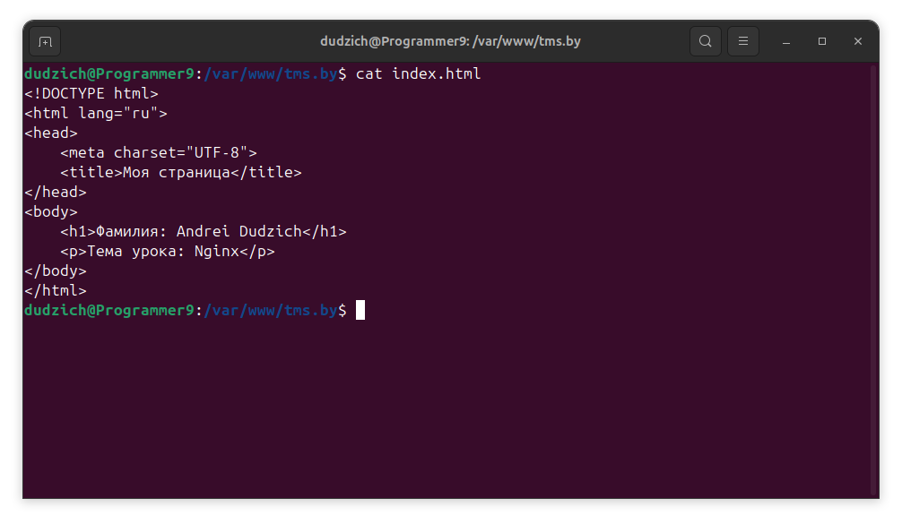
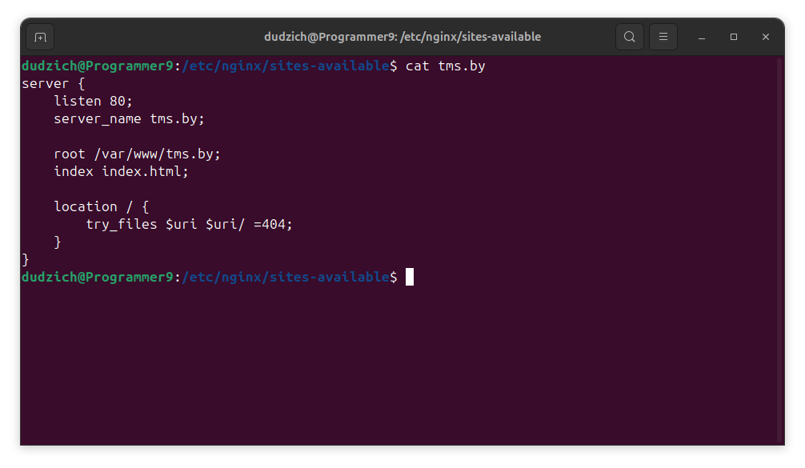

## Настройка Nginx с HTML-страницей

## Цель

Установить и настроить Nginx для отображения HTML-страницы с указанием фамилии и темы урока по адресу `http://tms.by`.

## Выполненные шаги

### 1. Установка Nginx

Для установки Nginx использовалась команда:

```bash
sudo apt update
sudo apt install nginx
```

После установки, Nginx должен быть запущен. Можно проверить его статус командой:

```
sudo systemctl status nginx
```



### 2. Создание HTML-страницы

Создана директория для сайта:

```Bash
sudo mkdir -p /var/www/tms.by
```

Переход в директорию сайта:

```Bash
cd /var/www/tms.by
```

Создан файл index.html со следующим содержимым:

```Bash
<!DOCTYPE html>
<html lang="ru">
<head>
    <meta charset="UTF-8">
    <title>Моя страница</title>
</head>
<body>
    <h1>Фамилия: Andrei Dudzich</h1>
    <p>Тема урока: Nginx</p>
</body>
</html>
```



### 3. Настройка конфигурации Nginx

Создан файл конфигурации /etc/nginx/sites-available/tms.by со следующим содержанием:

```Bash
server {
    listen 80;
    server_name tms.by;

    root /var/www/tms.by;
    index index.html;

    location / {
        try_files $uri $uri/ =404;
    }
}
```



Создана символическая ссылка для активации сайта:

```Bash
sudo ln -s /etc/nginx/sites-available/tms.by /etc/nginx/sites-enabled/
```

Проверка конфигурации Nginx:

```Bash
sudo nginx -t
```

[Место для скриншота вывода команды nginx -t]

Перезапуск Nginx для применения изменений:

```Bash
sudo systemctl restart nginx
```

### 4. Настройка /etc/hosts 

Для локального доступа к сайту по доменному имени tms.by добавлена строка в файл /etc/hosts:

```Bash
127.0.0.1    tms.by
```

### 5. Проверка

Открыт браузер и осуществлен переход по адресу http://tms.by. Отобразилась созданная HTML-страница.


Nginx успешно настроен для отображения HTML-страницы по адресу http://tms.by. Все необходимые шаги выполнены.
