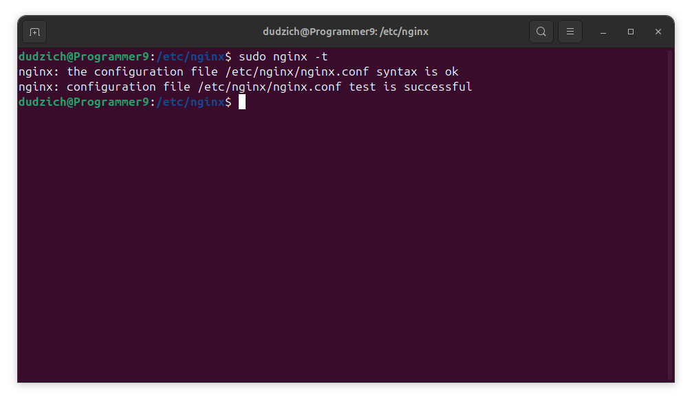
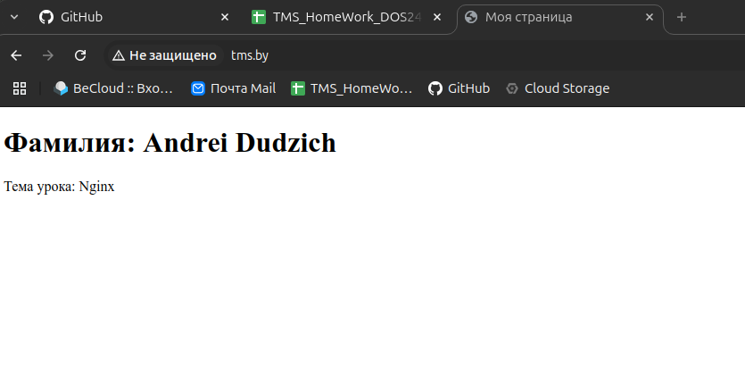
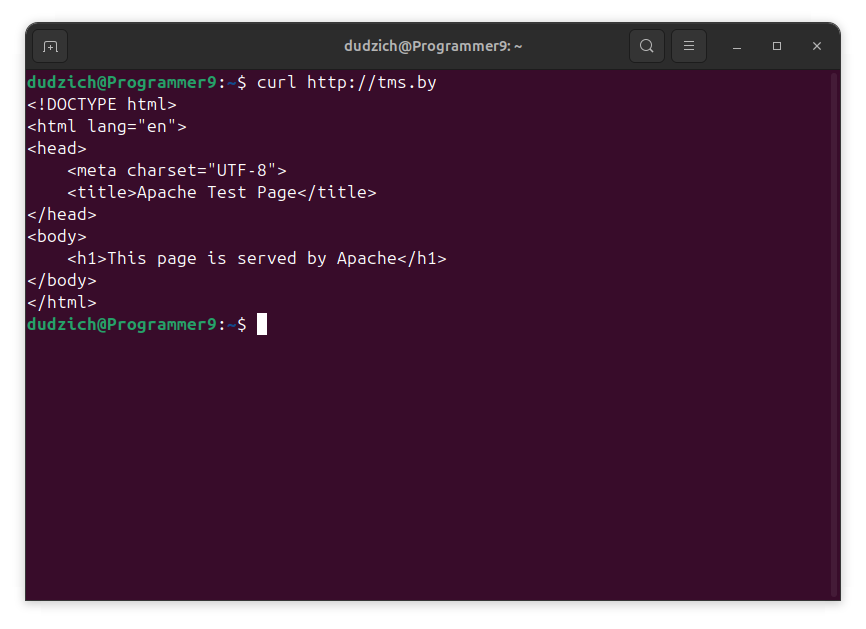

## Задание 1. Настройка Nginx с HTML-страницей

## Цель

Установить и настроить Nginx для отображения HTML-страницы с указанием фамилии и темы урока по адресу `http://tms.by`.

## Выполненные шаги

### 1. Установка Nginx

Для установки Nginx использовалась команда:

```bash
sudo apt update
sudo apt install nginx
```

После установки, Nginx должен быть запущен. Можно проверить его статус командой:

```
sudo systemctl status nginx
```


### 2. Создание HTML-страницы

Создана директория для сайта:

```Bash
sudo mkdir -p /var/www/tms.by
```

Переход в директорию сайта:

```Bash
cd /var/www/tms.by
```

Создан файл index.html со следующим содержимым:

```Bash
<!DOCTYPE html>
<html lang="ru">
<head>
    <meta charset="UTF-8">
    <title>Моя страница</title>
</head>
<body>
    <h1>Фамилия: Andrei Dudzich</h1>
    <p>Тема урока: Nginx</p>
</body>
</html>
```


### 3. Настройка конфигурации Nginx

Создан файл конфигурации /etc/nginx/sites-available/tms.by со следующим содержанием:

```Bash
server {
    listen 80;
    server_name tms.by;

    root /var/www/tms.by;
    index index.html;

    location / {
        try_files $uri $uri/ =404;
    }
}
```


Создана символическая ссылка для активации сайта:

```Bash
sudo ln -s /etc/nginx/sites-available/tms.by /etc/nginx/sites-enabled/
```

Проверка конфигурации Nginx:

```Bash
sudo nginx -t
```



Перезапуск Nginx для применения изменений:

```Bash
sudo systemctl restart nginx
```

### 4. Настройка /etc/hosts 

Для локального доступа к сайту по доменному имени tms.by добавлена строка в файл /etc/hosts:

```Bash
127.0.0.1    tms.by
```

### 5. Проверка

Открыт браузер и осуществлен переход по адресу http://tms.by. Отобразилась созданная HTML-страница.




Nginx успешно настроен для отображения HTML-страницы по адресу http://tms.by. Все необходимые шаги выполнены.

### Задание 2: Настройка связки Nginx + Apache (Reverse Proxy)

1.  **Установка Apache:**
    ```bash
    sudo apt update
    sudo apt install apache2
    ```
    
2.  **Создание тестового сайта для Apache:**

    *   Создана директория для тестового сайта:
        ```bash
        sudo mkdir -p /var/www/test-apache
        ```
    *   Переход в директорию:
        ```bash
         cd /var/www/test-apache
        ```
    *   Создан файл `index.html`:
    ```bash
    sudo nano index.html
    ```
    *   Добавлен HTML-код:
        ```html
        <!DOCTYPE html>
        <html lang="en">
        <head>
            <meta charset="UTF-8">
            <title>Apache Test Page</title>
        </head>
        <body>
            <h1>This page is served by Apache</h1>
        </body>
        </html>
        ```
   

3.  **Настройка виртуального хоста Apache:**

    *   Создан файл конфигурации `/etc/apache2/sites-available/test-apache.conf` со следующим содержанием:

        ```apache
        <VirtualHost *:8080>
            ServerName test-apache
            DocumentRoot /var/www/test-apache

            <Directory /var/www/test-apache>
                AllowOverride All
                Require all granted
            </Directory>

        </VirtualHost>
        ```

    *   Включение сайта и перезапуск apache:

        ```bash
        sudo a2ensite test-apache.conf
        sudo systemctl restart apache2
        ```
      
    

4.  **Изменение конфигурации Nginx (для reverse proxy):**

    *   Изменена конфигурация `/etc/nginx/sites-available/tms.by` на следующую:

        ```nginx
        server {
            listen 80;
            server_name tms.by;

            location / {
                proxy_pass http://127.0.0.1:8080;
                proxy_set_header Host $host;
                proxy_set_header X-Real-IP $remote_addr;
                proxy_set_header X-Forwarded-For $proxy_add_x_forwarded_for;
                proxy_set_header X-Forwarded-Proto $scheme;
             }
        }
        ```

    *   Перезапуск Nginx:
        ```bash
         sudo systemctl restart nginx
        ```

5.  **Проверка (Reverse Proxy):**

    Открыт браузер и осуществлен переход по адресу `http://tms.by`. Отобразилась страница "This page is served by Apache".

     
     
   *   Проверка через `curl`
        ```bash
         curl http://tms.by
        ```
    


## Результат

*   **Задание 1:** Nginx успешно настроен для отображения HTML-страницы.
*   **Задание 2:** Связка Nginx + Apache успешно настроена, Nginx выступает в качестве обратного прокси.