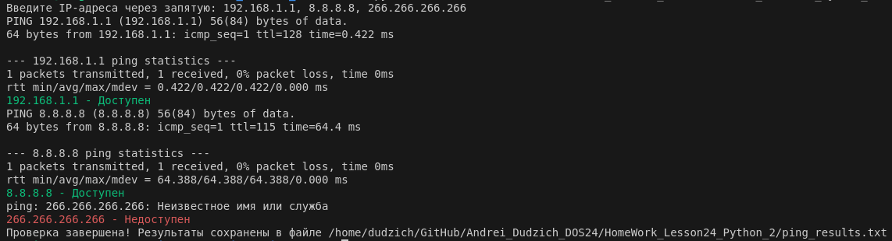
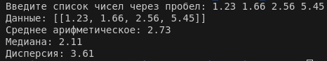

**Задание:**
Выберите одно или несколько заданий из приведённого списка и выполните их.

Обязательный минимум задач к выполнению: 5 из основного блока. Задания из не основного блока выполняются по желанию

### **Задания:**
1. **Проверка доступности IP-адресов:**
- Напишите скрипт, который принимает на вход список IP-адресов и проверяет их доступность с помощью ping-запросов. Результаты проверки должны сохраняться в отдельный файл.

***Реализация***
```Python
import os

# Определение текущей директории для создания в ней файла
current_dir = os.path.dirname(os.path.abspath(__file__))
file_path = os.path.join(current_dir, "ping_results.txt")

# IP через запятую
input_ips = input("Введите IP-адреса через запятую: ")
ips = [ip.strip() for ip in input_ips.split(",")]

with open(file_path, "w") as file:
    for ip in ips:
        
        command = f"ping -c 1 {ip}"
        
        response = os.system(command)
        
        if response == 0:
            result = f"{ip} - {'Доступен'}"
            print(f"\033[32m{result}\033[0m")
        else:
            result = f"{ip} - {'Недоступен'}"
            print(f"\033[31m{result}\033[0m")
        
        file.write(result + "\n")

print(f"Проверка завершена! Результаты сохранены в файле {file_path}")
```


2. **Уникальность элементов в кортеже:**
- Напишите скрипт, который принимает на вход кортеж и проверяет, все ли его элементы являются уникальными.

***Реализация***
```Python
from collections import Counter

input_tuple = input("Введите кортеж (элементы через запятую): ")

# Преобразуем строку в кортеж
input_tuple = tuple(input_tuple.split(","))

# Подсчитываем количество каждого элемента
counter = Counter(input_tuple)

if len(input_tuple) == len(counter):
    print("Все элементы уникальны")
else:
    print("Есть повторяющиеся элементы")

    print("Повторяющиеся элементы:")
    for element, count in counter.items():
        if count > 1:
            print(f"{element} - {count} раз(а)")

```

3. **Поиск файлов по подстроке:**
- Напишите скрипт, который принимает на вход список файлов и находит те, имена которых содержат определённую подстроку.

***Реализация***
```Python
import os

directory = input("Введите путь к директории (или нажмите Enter для текущей): ")

#Текекущая директория
if not directory:
    directory = os.getcwd()

substring = input("Введите подстроку для поиска в названиях файлов: ")

if not os.path.isdir(directory):
    print("Указанный путь не является директорией или не существует.")
else:

    matching_files = []

    # Обход всех файлов в директории и поддиректориях
    for root, dirs, files in os.walk(directory):
        for file in files:
            if substring in file:
                # Добавляем найденный файл в список
                matching_files.append(os.path.join(root, file))

    if matching_files:
        print("Найденные файлы:")
        for file in matching_files:
            print(file)
    else:
        print("Файлы, содержащие подстроку, не найдены.")
```

4. **Общие символы в строках:**
- Напишите скрипт, который принимает на вход две строки и выводит на экран все символы, которые встречаются в обеих строках.

***Реализация***
```Python
str1 = input("Введите первую строку: ")
str2 = input("Введите вторую строку: ")

# Поиск общих символов с использованием множеств
common_chars = set(str1) & set(str2)

if common_chars:
    print("Общие символы:", ",".join(common_chars))
else:
    print("Общих символов нет")

```

5. **Статистика списка чисел:**
- Напишите скрипт, который принимает на вход список чисел и вычисляет медиану, среднее арифметическое и дисперсию этого списка.

***Реализация***
```Python
import statistics

def calculate_statistics(numbers):
    if not numbers:
        return "Список чисел пуст."
    
    mean_value = statistics.mean(numbers)
    median_value = statistics.median(numbers)
    variance_value = statistics.variance(numbers) if len(numbers) > 1 else 0
    
    return {
        "Среднее арифметическое": mean_value,
        "Медиана": median_value,
        "Дисперсия": variance_value
    }

if __name__ == "__main__":
    try:
        numbers = list(map(float, input("Введите список чисел через пробел: ").split()))
        result = calculate_statistics(numbers)
        print(f"Данные: [{numbers}]")
        for key, value in result.items():
            print(f"{key}: {value:.2f}")
    except ValueError:
        print("Ошибка: Введите корректные числовые значения.")
```


6. **Замена гласных в строке:**
- Напишите скрипт, который принимает на вход строку и заменяет в ней все гласные буквы на символ ""-"".

***Реализация***
```Python

```

7. **Общие и уникальные элементы списков:**
- Напишите скрипт, который принимает на вход два списка, находит их общие элементы и создаёт новый список, содержащий только уникальные элементы.

***Реализация***
```Python

```

8. **Фильтрация чисел в списке:**
- Напишите скрипт, который принимает на вход список чисел и удаляет из него все числа, которые меньше заданного пользователем значения.

***Реализация***
```Python

```

9. **Сортировка строк по длине:**
- Напишите скрипт, который принимает на вход список строк и сортирует их по длине в порядке возрастания.

***Реализация***
```Python

```

10. **Создание словаря частот символов:**
- Напишите скрипт, который принимает на вход строку и создаёт словарь, где ключи — это символы, а значения — количество их появлений в строке.

***Реализация***
```Python

```

11. **Реверс строк:**
- Напишите скрипт, который принимает на вход список строк и выводит их в обратном порядке, причём каждую строку тоже нужно реверсировать.

***Реализация***
```Python

```

12. **Подсчёт слов в файле:**
- Напишите скрипт, который принимает на вход текстовый файл и подсчитывает количество слов в нём.

***Реализация***
```Python

```

13. **Парсинг JSON:**
- Напишите скрипт, который загружает JSON-файл, выводит на экран ключи верхнего уровня и значения, а затем сохраняет его в новом формате с отступами.

***Реализация***
```Python

```

### **Задания сложного уровня:**

14. **Обработка больших данных:**
- Напишите скрипт, который читает большой CSV-файл построчно и вычисляет среднее значение числового столбца. При этом объём памяти должен оставаться минимальным.
15. **Алгоритм поиска подстроки:**
- Реализуйте скрипт, который проверяет, входит ли одна строка в другую, без использования встроенных функций поиска (`in`, `find` и т.д.). Используйте алгоритм Кнута-Морриса-Пратта.

### **Задания для Middle Python Developer:**
16. **Реализация мини-фреймворка:**
- Напишите небольшой веб-сервер на основе библиотеки `http.server`, который обрабатывает запросы GET и POST, а также возвращает динамически сгенерированный HTML.

17. **Оптимизация алгоритма:**
- Напишите скрипт, который находит все пары чисел в списке, сумма которых равна заданному значению. Оптимизируйте скрипт для работы со списками длиной в миллион элементов.
