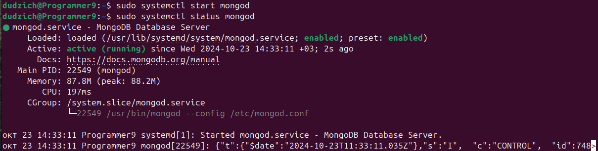
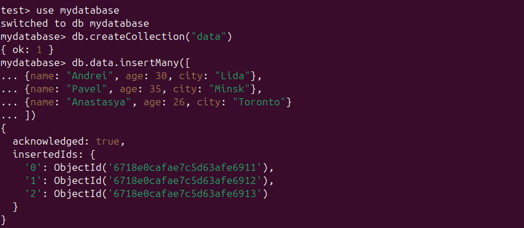
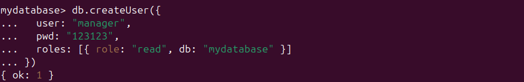
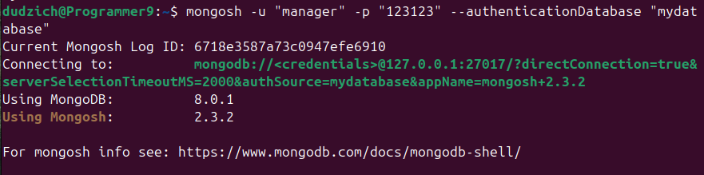
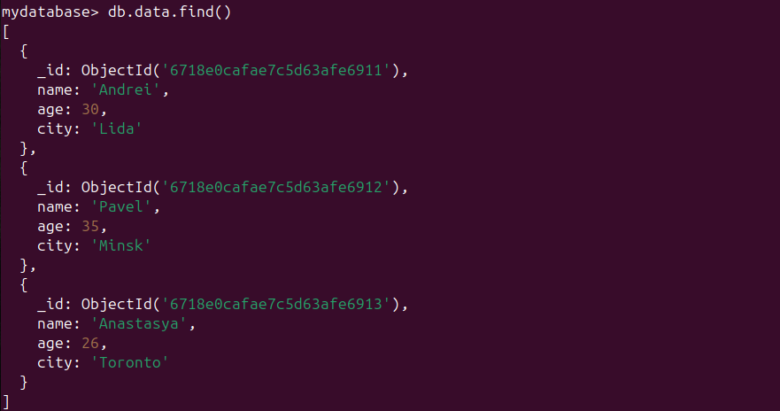
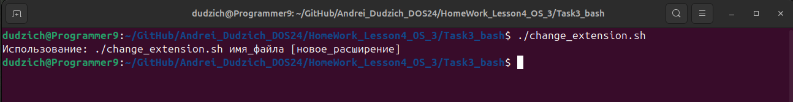
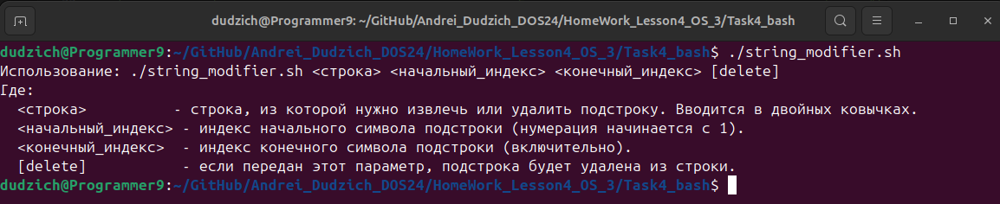
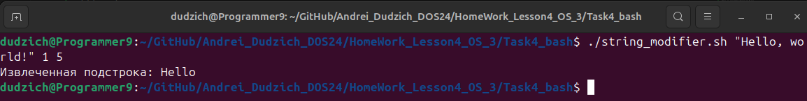
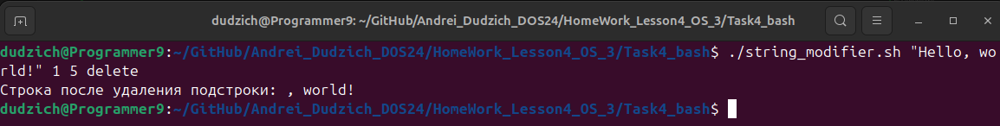

### Задание:
1. Установить MongoDB.
* Создать таблицу data.
* Создать пользователя manager, у которого будет доступ только на чтение этой таблицы.
2. Ознакомиться с нижеуказанной статьей по теме «Bash» https://habr.com/ru/post/52871/.

3. Написать Bash-скрипт в соответствии с требованиями:
* _Содержание скрипта_: замена существующего расширения в имени файла на заданное.
* Исходное имя файла и новое расширение передаются скрипту в качестве параметров.
* _Основное средство_: нестандартное раскрытие переменных.
* _Усложнение_: предусмотреть штатную реакцию на отсутствие расширения в исходном имени файла.
4. Написать Bash-скрипт в соответствии с требованиями:
* _Содержание скрипта_: выделение из исходной строки подстроки с границами, заданными порядковыми номерами символов в исходной строке.
* _Усложнение_: предусмотреть возможность не выделения, а удаления подстроки.
* _Основные средства_: команда cut, переменные оболочки.

#### 1. Установка MongoDB

Производим установку GNU Privacy Guard и Client URL для дальнейшего импорта открытого ключа GPG, если они ещё не установлены:

```Bash
sudo apt-get install gnupg curl
```
Далее импортируем открытый ключ GPG MongoDB:

```Bash
curl -fsSL https://www.mongodb.org/static/pgp/server-8.0.asc | \
   sudo gpg -o /usr/share/keyrings/mongodb-server-8.0.gpg \
   --dearmor
```
Затем добавляем себе в систему официальный репозиторий для устакновки MongoDB 8.0, соответствующий версии нашей системы 24.04 LTS ("Noble"):

```Bash
echo "deb [ arch=amd64,arm64 signed-by=/usr/share/keyrings/mongodb-server-8.0.gpg ] https://repo.mongodb.org/apt/ubuntu noble/mongodb-org/8.0 multiverse" | sudo tee /etc/apt/sources.list.d/mongodb-org-8.0.list
```
Далее обновляем базу пакетов и производим установку последней стабильной версии MongoDB:

```Bash
sudo apt-get update
sudo apt-get install mongodb-org -y
```

Запускаем установленную MongoDB:

```Bash
sudo systemctl start mongod
```
И добавляем в автозагрузку системы:

```Bash
sudo systemctl enable mongod
```
Запускаем и проверяем статус:

```Bash
sudo systemctl start mongod
sudo systemctl status mongod
```


Запускаем оболочку для работы с MongoDB:

```Bash
mongosh
```

Заходим в базу `mydatabase`, создаем коллекцию `data` и заполняем её какими-то произвольными значениями:

```
use madatabase
db.data.insertMany([
 {name: "Andrei", age: 30, city: "Lida"},
 {name: "Pavel", age: 35, city: "Minsk"},
 {name: "Anastasya", age: 26, city: "Toronto"}
 ])
```


Создаем пользователя `manager` и даем ему права только на чтение:

```
db.createUser({
   user: "manager",
   pwd: "123123",
   roles: [{ role: "read", db: "mydatabase" }]
 })
 ```
 

 Далее авторизируемся в базе данных `mydatabase` под созданным пользователем:

 ```
 mongosh -u "manager" -p "123123" --authenticationDatabase "mydatabase"
 ```
 
 
 И с помощью команды `db.data.find()` проверяем содержимое таблицы:
 
 

#### 2. Создание Bash-скрипта, который изменяет расширение файла
Создан скрипт `change_extension.sh` и добавлен файл `serious_man.jpeg` для проверки его работоспособности.

Этот Bash-скрипт выполняет переименование файла, заменяя его расширение на новое, переданное в качестве второго параметра. Если второе расширение не указано, скрипт удаляет текущее расширение, создавая файл без него.

Этот скрипт имеет следующие функциональные блоки:
1. _Проверка количества аргументов_

Скрипт требует обязательного первого аргумента. Второй аргумент (новое расширение файла) является необязательным.
```Bash
if [ "$#" -lt 1 ]; then
    echo "Использование: $0 имя_файла [новое_расширение]"
    exit 1  # Завершаем выполнение скрипта с кодом ошибки
fi
```

2. _Извлечение имени файла и расширения_

Первый аргумент сохраняется как исходное имя файла, второй аргумент - как новое расширение. Если новое расширение не указано, переменная `new_extension` остается пустой.
```Bash
file="$1"
new_extension="$2"
```

3. _Определение базового имени файла (без расширения)_

Используется выражение `${file%.*}`, которое удаляет расширение (если оно есть), оставляя только имя файла до последней точки.
```Bash
base_name="${file%.*}"
```

4. _Проверка наличия расширения в исходном файле_

Если исходное имя файла не изменяется после удаления расширения, это значит, что файл не имеет расширения.
```Bash
if [ "$file" = "$base_name" ]; then
    echo "Файл не содержит расширения."
else
    echo "Файл содержит расширение: ${file##*.}"
fi
```

5. _Определение нового имени файла_

Если второе расширение (второй аргумент) не передано или пустое, скрипт создаст новый файл без расширения (то есть просто переименует файл, удалив его текущее расширение).
Если расширение передано, оно добавляется к имени файла.
```Bash
if [ -z "$new_extension" ]; then
    echo "Новое расширение не указано. Создаём файл без расширения."
    new_file="$base_name"  # Новый файл будет без расширения
else
    new_file="${base_name}.${new_extension}"  # Применяем новое расширение
fi
```

6. _Переименование файла_

Команда `mv` выполняет фактическое переименование файла на диске.
```Bash
mv "$file" "$new_file"
```

7. _Вывод результата_

После успешного выполнения скрипта выводится сообщение с новым именем файла.
```Bash
echo "Файл переименован: $new_file"
```

***Пример использования***

По умолчанию скрипт не имеет прав на выполнение, по-этому добавляем эти права:
```Bash
chmod +x change_extension.sh
```
Это сделает скрипт исполняемым.

Для получения инфо необходимо запустить скрипт без параметров:
```Bash
./change_extension.sh
```


Если мы хотим изменить расширение файла `serious_man.png` на `jpeg`, запускаем скрипт со следующими параметрами:
```Bash
./change_extension.sh serious_man.png jpeg
```


Если мы хотим удалить расширение файла `serious_man.jpeg`, используем следующие параметры:
```Bash
./change_extension.sh serious_man.jpeg
```


Если же мы хотим добавить отсутствующее расширение, запускаем скрипт следующим оброазом:
```Bash
./change_extension.sh serious_man jpeg
```


#### 3. Создание Bash-скрипта, который выделяет из исходной строки подстроки с границами, заданными порядковыми номерами символов в исходной строке. Реализация удаления подстроки.

Создан скрипт `string_modifier.sh`. 
Скрипт предназначен для работы с подстроками строки. Он может извлекать подстроку по заданным индексам или удалять её, если указан дополнительный параметр.

Скрипт принимает 3 или 4 аргумента:

1. _Строка_ — текст, в котором будет производиться извлечение или удаление подстроки. Если строка содержит пробелы, её необходимо заключить в кавычки.

2. _Начальный индекс_ — порядковый номер первого символа подстроки (нумерация начинается с 1).

3. _Конечный индекс_ — порядковый номер последнего символа подстроки (включительно).

4. _Опциональный параметр **delete**_ — указывает на необходимость удаления подстроки. Если не передан, подстрока просто извлекается и выводится на экран.

Этот скрипт имеет следующие функциональные блоки:

1. _Информация по использованию скрипта_

```Bash
if [ "$#" -lt 3 ]; then
    echo "Использование: $0 <строка> <начальный_индекс> <конечный_индекс> [delete]"
    echo "Где:"
    echo "  <строка>          - строка, из которой нужно извлечь или удалить подстроку."
    echo "  <начальный_индекс> - индекс начального символа подстроки (нумерация начинается с 1)."
    echo "  <конечный_индекс>  - индекс конечного символа подстроки (включительно)."
    echo "  [delete]           - если передан этот параметр, подстрока будет удалена из строки."
    exit 1
fi
```
Этот блок проверяет, передал ли пользователь достаточное количество аргументов (минимум 3). Если количество аргументов меньше 3, выводится сообщение с информацией о правильном использовании скрипта и его параметрах.

2. _Получение аргументов_

```Bash
input_string="$1"
start_index="$2"
end_index="$3"
delete_substring="${4:-false}"
```

Здесь происходит получение и сохранение аргументов в переменные:

* `input_string` - строка, из которой будет извлекаться подстрока.
* `start_index` - начальный индекс подстроки (число, указывающее, с какого символа начинать).
* `end_index` - конечный индекс подстроки (число, указывающее, на каком символе заканчивать).
* `delete_substring` - опциональный параметр. Если он не передан, по умолчанию его значение — "false".

3. _Проверка индексов_

```Bash
string_length=${#input_string}

if [ "$start_index" -lt 1 ] || [ "$end_index" -gt "$string_length" ] || [ "$start_index" -gt "$end_index" ]; then
    echo "Ошибка: индексы находятся вне допустимого диапазона!"
    echo "Длина строки: $string_length, начальный индекс: $start_index, конечный индекс: $end_index"
    exit 1
fi
```

Этот блок определяет длину входной строки с помощью `${#input_string}`.Затем проверяет корректность переданных индексов:
 * `start_index` должен быть не меньше 1.
 * `end_index` не должен превышать длину строки.
 * `start_index` не может быть больше end_index.

Если одно из условий не выполнено, выводится сообщение об ошибке, и скрипт завершается.

4. _Извлечение подстроки_
```Bash
substring=$(echo "$input_string" | cut -c"$start_index"-"$end_index")
```
Аргументы `-c"$start_index"-"$end_index"` указывают на диапазон символов, который необходимо извлечь, используя значения `start_index` и `end_index`.

5. _Удаление или вывод подстроки_
```Bash
if [ "$delete_substring" == "delete" ]; then
    modified_string="${input_string//$substring/}"
    echo "Строка после удаления подстроки: $modified_string"
else
    echo "Извлеченная подстрока: $substring"
fi
```
Этот блок проверяет, был ли передан параметр `delete`.

Если параметр равен `delete`, то с помощью подстановки `${input_string//$substring/}` удаляется извлеченная подстрока из исходной строки и выводится сообщение с измененной строкой. Если параметр не передан или не равен `delete`, просто выводится извлечённая подстрока.

***Итоговая структура***

Скрипт выполняет следующие основные функции:

1. Проверка входных параметров и вывод инструкции по использованию.
2. Получение и сохранение аргументов в переменные.
3. Проверка корректности индексов для извлечения подстроки.
4. Извлечение подстроки из исходной строки.
5. Удаление подстроки или вывод её на экран в зависимости от переданных параметров.

***Примеры использования***

По умолчанию скрипт не имеет прав на выполнение, по-этому добавляем эти права:
```Bash
chmod +x string_modifier.sh
```
Это сделает скрипт исполняемым.

Смотрим инфо по скрипту, введя его без параметров:
```Bash
./string_modifier.sh
```



Для извлечения подстроки вводим строку и индексы символов, которые будут огриничивать нашу извлекаумую подстроку (нумерация начинается с 1):
```Bash
./string_modifier.sh "Hello, world!" 1 5
```


Для удаления подстроки вводим строку и индексы символов, которые будут огриничивать нашу удаляемую подстроку (нумерация начинается с 1):
```Bash
./string_modifier.sh "Hello, world!" 1 5 delete
```
