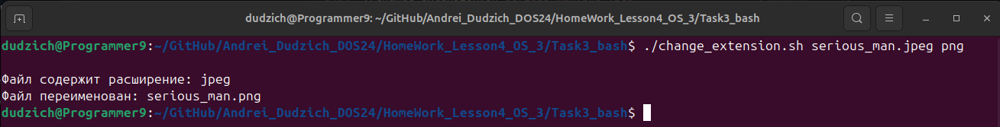
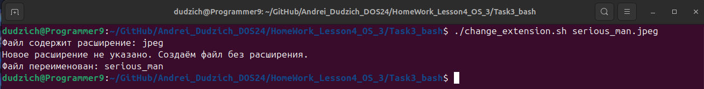
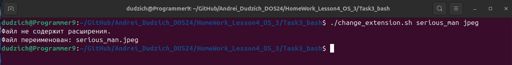

## Задание:
1. Установить MongoDB. Создать таблицу data. Создать пользователя manager, у которого будет доступ только на чтение этой таблицы.
2. Ознакомиться с нижеуказанной статьей по теме «Bash» https://habr.com/ru/post/52871/
3. Написать Bash-скрипт в соответствии с требованиями:
Содержание скрипта: замена существующего расширения в имени файла на заданное. Исходное имя файла и новое расширение передаются скрипту в качестве параметров.
Основное средство: нестандартное раскрытие переменных.
Усложнение: предусмотреть штатную реакцию на отсутствие расширения в исходном имени файла.
4. Написать Bash-скрипт в соответствии с требованиями:
Содержание скрипта: выделение из исходной строки подстроки с границами, заданными порядковыми номерами символов в исходной строке.
Усложнение: предусмотреть возможность не выделения, а удаления подстроки.
Основные средства: команда cut, переменные оболочки.

### 1. Установка MongoDB
Производим установку GNU Privacy Guard и Client URL для дальнейшего импорта открытого ключа GPG, если они ещё не установлены:
```Bash
sudo apt-get install gnupg curl
```
Далее импортируем открытый ключ GPG MongoDB:
```Bash
curl -fsSL https://www.mongodb.org/static/pgp/server-8.0.asc | \
   sudo gpg -o /usr/share/keyrings/mongodb-server-8.0.gpg \
   --dearmor
```
Затем добавляем себе в систему официальный репозиторий для устакновки MongoDB 8.0, соответствующий версии нашей системы 24.04 LTS ("Noble"):
```Bash
echo "deb [ arch=amd64,arm64 signed-by=/usr/share/keyrings/mongodb-server-8.0.gpg ] https://repo.mongodb.org/apt/ubuntu noble/mongodb-org/8.0 multiverse" | sudo tee /etc/apt/sources.list.d/mongodb-org-8.0.list
```
Далее обновляем базу пакетов и производим установку последней стабильной версии MongoDB:
```Bash
sudo apt-get update
sudo apt-get install mongodb-org -y
```

Запускаем установленную MongoDB:
```Bash
sudo systemctl start mongod
```
И добавляем в автозагрузку системы:
```Bash
sudo systemctl enable mongod
```
Запускаем и проверяем статус:
```Bash
sudo systemctl start mongod
sudo systemctl status mongod
```

Запускаем оболочку для работы с MongoDB:
```Bash
mongosh
```

Заходим в базу `mydatabase`, создаем коллекцию `data` и заполняем её какими-то произвольными значениями:
```
use madatabase
db.data.insertMany([
 {name: "Andrei", age: 30, city: "Lida"},
 {name: "Pavel", age: 35, city: "Minsk"},
 {name: "Anastasya", age: 26, city: "Toronto"}
 ])
```


Создаем пользователя `manager` и даем ему права только на чтение:
```
db.createUser({
   user: "manager",
   pwd: "123123",
   roles: [{ role: "read", db: "mydatabase" }]
 })
 ```
 

 Далее авторизируемся в базе данных `mydatabase` под созданным пользователем:
 ```
 mongosh -u "manager" -p "123123" --authenticationDatabase "mydatabase"
 ```
 
 
 И с помощью команды `db.data.find()` проверяем содержимое таблицы:
 
 

### 2. Создание Bash-скрипта, который изменяет расширение файла
Создан скрипт `change_extension.sh` и добавлен файл `serious_man.jpeg` для проверки его работоспособности.

Этот Bash-скрипт выполняет переименование файла, заменяя его расширение на новое, переданное в качестве второго параметра. Если второе расширение не указано, скрипт удаляет текущее расширение, создавая файл без него.

#### Шаги работы скрипта:
1. _Проверка количества аргументов._
Скрипт требует обязательного первого аргумента. Второй аргумент (новое расширение файла) является необязательным.
```Bash
if [ "$#" -lt 1 ]; then
    echo "Использование: $0 имя_файла [новое_расширение]"
    exit 1  # Завершаем выполнение скрипта с кодом ошибки
fi
```
2. _Извлечение имени файла и расширения._
Первый аргумент сохраняется как исходное имя файла, второй аргумент - как новое расширение. Если новое расширение не указано, переменная `new_extension` остается пустой.
```Bash
file="$1"
new_extension="$2"
```
3. _Определение базового имени файла (без расширения)._
Используется выражение `${file%.*}`, которое удаляет расширение (если оно есть), оставляя только имя файла до последней точки.
```Bash
base_name="${file%.*}"
```
4. _Проверка наличия расширения в исходном файле._
Если исходное имя файла не изменяется после удаления расширения, это значит, что файл не имеет расширения.
```Bash
if [ "$file" = "$base_name" ]; then
    echo "Файл не содержит расширения."
else
    echo "Файл содержит расширение: ${file##*.}"
fi
```
5. _Определение нового имени файла._
Если второе расширение (второй аргумент) не передано или пустое, скрипт создаст новый файл без расширения (то есть просто переименует файл, удалив его текущее расширение).
Если расширение передано, оно добавляется к имени файла.
```Bash
if [ -z "$new_extension" ]; then
    echo "Новое расширение не указано. Создаём файл без расширения."
    new_file="$base_name"  # Новый файл будет без расширения
else
    new_file="${base_name}.${new_extension}"  # Применяем новое расширение
fi
```
6. _Переименование файла._
Команда `mv` выполняет фактическое переименование файла на диске.
```Bash
mv "$file" "$new_file"
```
7. _Вывод результата._
После успешного выполнения скрипта выводится сообщение с новым именем файла.
```Bash
echo "Файл переименован: $new_file"
```

#### Пример использования:
Если мы хотим изменить расширение файла `serious_man.png` на `jpeg`, запускаем скрипт со следующими параметрами:
```Bash
./change_extension.sh serious_man.png jpeg
```


Если мы хотим удалить расширение файла `serious_man.jpeg`, используем следующие параметры:
```Bash
./change_extension.sh serious_man.jpeg
```


Если же мы хотим добавить отсутствующее расширение, запускаем скрипт следующим оброазом:
```Bash
./change_extension.sh serious_man jpeg
```

