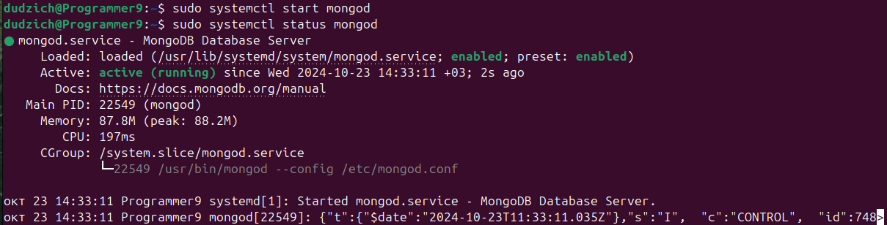
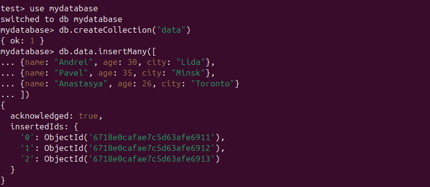
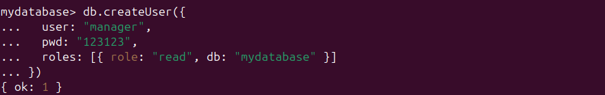

# Задание:
1. Установить MongoDB. Создать таблицу data. Создать пользователя manager, у которого будет доступ только на чтение этой таблицы.
2. Ознакомиться с нижеуказанной статьей по теме «Bash» https://habr.com/ru/post/52871/
3. Написать Bash-скрипт в соответствии с требованиями:
Содержание скрипта: замена существующего расширения в имени файла на заданное. Исходное имя файла и новое расширение передаются скрипту в качестве параметров.
Основное средство: нестандартное раскрытие переменных.
Усложнение: предусмотреть штатную реакцию на отсутствие расширения в исходном имени файла.
4. Написать Bash-скрипт в соответствии с требованиями:
Содержание скрипта: выделение из исходной строки подстроки с границами, заданными порядковыми номерами символов в исходной строке.
Усложнение: предусмотреть возможность не выделения, а удаления подстроки.
Основные средства: команда cut, переменные оболочки.

## Установка MongoDB
Производим установку GNU Privacy Guard и Client URL для дальнейшего импорта открытого ключа GPG, если они ещё не установлены:
```Bash
sudo apt-get install gnupg curl
```
Далее импортируем открытый ключ GPG MongoDB:
```Bash
curl -fsSL https://www.mongodb.org/static/pgp/server-8.0.asc | \
   sudo gpg -o /usr/share/keyrings/mongodb-server-8.0.gpg \
   --dearmor
```
Затем добавляем себе в систему официальный репозиторий для устакновки MongoDB 8.0, соответствующий версии нашей системы 24.04 LTS ("Noble"):
```Bash
echo "deb [ arch=amd64,arm64 signed-by=/usr/share/keyrings/mongodb-server-8.0.gpg ] https://repo.mongodb.org/apt/ubuntu noble/mongodb-org/8.0 multiverse" | sudo tee /etc/apt/sources.list.d/mongodb-org-8.0.list
```
Далее обновляем базу пакетов и производим установку последней стабильной версии MongoDB:
```Bash
sudo apt-get update
sudo apt-get install mongodb-org -y
```

Запускаем установленную MongoDB:
```Bash
sudo systemctl start mongod
```
И добавляем в автозагрузку системы:
```Bash
sudo systemctl enable mongod
```
Запускаем и проверяем статус:
```Bash
sudo systemctl start mongod
sudo systemctl status mongod
```

Запускаем оболочку для работы с MongoDB:
```Bash
mongosh
```

Заходим в базу `mydatabase`, создаем коллекцию `data` и заполняем её какими-то произвольными значениями:
```
use madatabase
db.data.insertMany([
 {name: "Andrei", age: 30, city: "Lida"},
 {name: "Pavel", age: 35, city: "Minsk"},
 {name: "Anastasya", age: 26, city: "Toronto"}
 ])
```


Создаем пользователя `manager` и даем ему права только на чтение:
```
db.createUser({
   user: "manager",
   pwd: "123123",
   roles: [{ role: "read", db: "mydatabase" }]
 })
 ```
 

 Далее авторизируемся в базе данных `mydatabase` под созданным пользователем:
 ```
 mongosh -u "manager" -p "123123" --authenticationDatabase "mydatabase"
 ```
 
 
 И с помощью команды `db.data.find()` проверяем содержимое таблицы:
 
 
