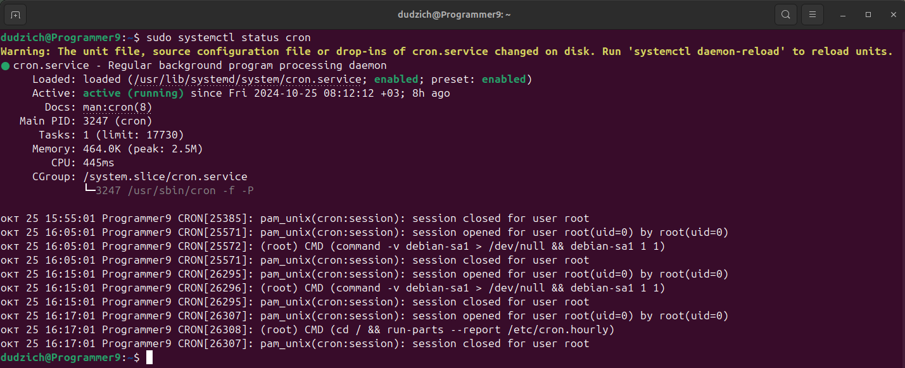
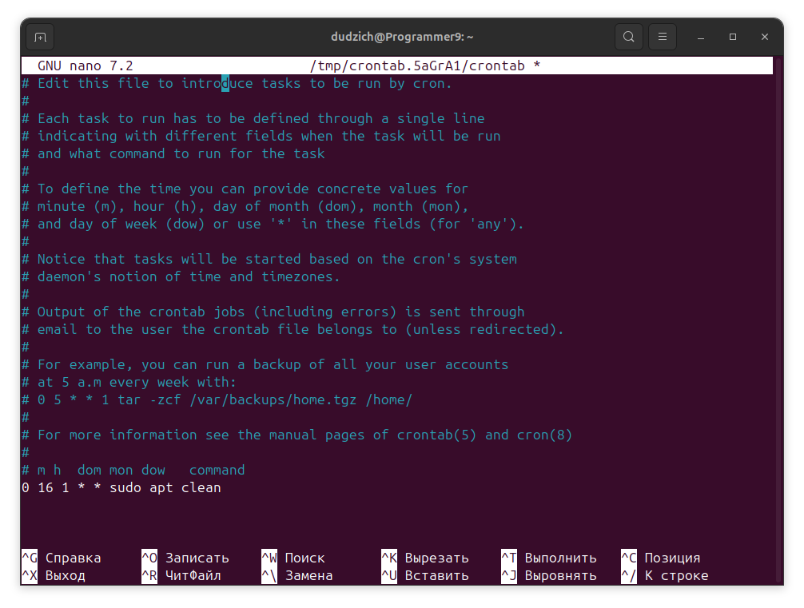

### Задание
1. Добавить в **cron** скрипт/команду,которая будет очищать кэш apt
(кэшируемые пакеты, пакеты,которые не могут быть загружены) раз в месяц в
16 часов.
2. Запустить демон nodejs-приложения через systemd.

### 1. Автоматизация очистки кэша apt через cron.

Сперва проверяем, запущен ли cron:
```Bash
sudo systemctl status cron
```

Видим следующий вывод и двигаемся дальше.

Для удаления кэшированных пакетов используем команду:
```Bash
sudo apt clean
```
Эта команда удалит все скачанные `.deb` файлы из `/var/cache/apt/archives` и освободит место.

Для добавления команды в cron открываем `crontab` для редактирования:
```Bash
crontab -e
```
Добавляем строку, которая будет выполнять команду `sudo apt clean` раз в месяц в 16:00:
```Bash
0 16 1 * * sudo apt clean
```

Пояснение расписания:

    0 — минутная часть (ровно 00 минут),
    16 — час (16:00),
    1 — день месяца (первое число),
    * * — каждый месяц и любой день недели.

Эта запись выполнит команду `sudo apt clean` в 16:00 каждого первого числа месяца.