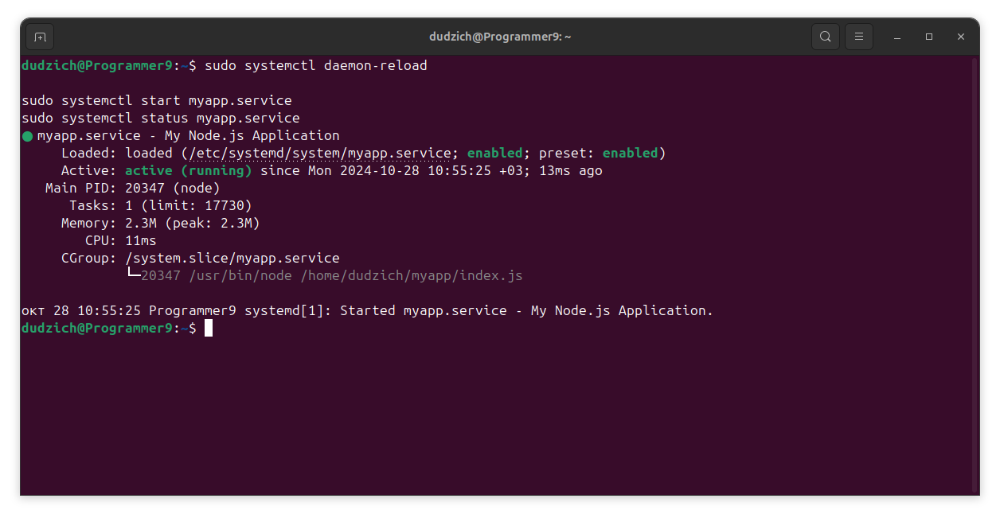

### Задание
1. Добавить в **cron** скрипт/команду,которая будет очищать кэш apt
(кэшируемые пакеты, пакеты,которые не могут быть загружены) раз в месяц в
16 часов.
2. Запустить демон nodejs-приложения через systemd.

### 1. Автоматизация очистки кэша apt через cron.

Сперва проверяем, запущен ли cron:
```Bash
sudo systemctl status cron
```

Видим следующий вывод и двигаемся дальше.

Для удаления кэшированных пакетов используем команду:
```Bash
sudo apt clean
```
Эта команда удалит все скачанные `.deb` файлы из `/var/cache/apt/archives` и освободит место.

Для добавления команды в cron открываем `crontab` для редактирования:
```Bash
crontab -e
```
Добавляем строку, которая будет выполнять команду `sudo apt clean` раз в месяц в 16:00:
```Bash
0 16 1 * * sudo apt clean
```

Пояснение расписания:

    0 — минутная часть (ровно 00 минут),
    16 — час (16:00),
    1 — день месяца (первое число),
    * * — каждый месяц и любой день недели.

Эта запись выполнит команду `sudo apt clean` в 16:00 каждого первого числа месяца.

### 2. Запуск демона nodejs-приложения через systemd.

Для создания приложения необходимо установить `Node.js`:
```Bash
sudo apt update
sudo apt install nodejs npm -y
```
Создаем директорию для приложения и переходим в неё:
```Bash
mkdir ~/myapp
cd ~/myapp
```
Инициализируем npm, устанавливаем зависимости и добавляем библиотеку `express` в директорию приложения:
```Bash
npm init -y
npm install express
```
Далее создаём файл `index.js` с простым сервером:
```Bash
// ~/myapp/index.js
const express = require('express');
const app = express();
const PORT = process.env.MYAPP_PORT || 3000;

app.get('/', (req, res) => {
    res.send('200 OK\n');
});

app.get('/kill', (req, res) => {
    res.send('Shutting down\n');
    process.exit(1);
});

app.listen(PORT, () => {
    console.log(`Server is running on port ${PORT}\n`);
});
```
И проверяем, что приложение запускается, используя команду `node index.js` и перейдя в браузере по адресу `http://localhost:3000/`, чтобы убедиться, что сервер отвечает.


Создаем файл сервиса `myapp.service` в `/etc/systemd/system/`:
```Bash
sudo nano /etc/systemd/system/myapp.service
```

И добавляем в него сдедующий код:
```Bash
[Unit]
Description=My Node.js Application
After=network.target

[Service]
Environment=MYAPP_PORT=3000
ExecStart=/usr/bin/node /home/dudzich/myapp/index.js
Restart=always
User=www-data
Group=www-data
WorkingDirectory=/home/dudzich/myapp

[Install]
WantedBy=multi-user.target
```
Указывая в нем порт по умолчанию, пути к `node.js`, исполняемому файлу приложения `index.js` и дирректории приложения `/home/dudzich/myapp`.

Далее перезагружаем `systemd`, запускаем наш сервис и проверяем его статус:
```Bash
sudo systemctl daemon-reload

sudo systemctl start myapp.service
sudo systemctl status myapp.service
```


Проверяем работу через `curl`:
```Bash
sudo systemctl daemon-reload
sudo systemctl restart myapp.service
sudo systemctl status myapp.service
```

