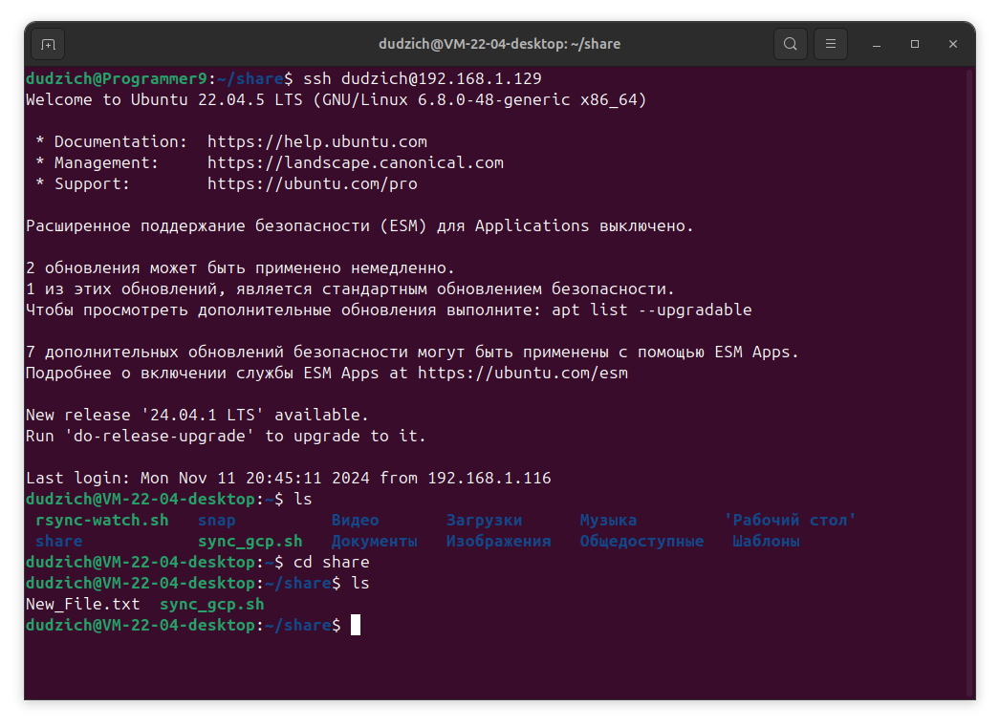

### *Реазилация синхронизации папок между двумя VM и хостом.*

Для реализации синхронизации папок между тремя машинами с помощью `Rsync` можно настроить синхронизацию по расписанию, используя лишь `cron`. Но мы реализуем синхронизацию в режиме реального времени с помощью утилиты `inotifywait`, которая входит в пакет `inotify-tools`.

    Host: Ubuntu Desktop 24.04 - 192.168.1.16/24.
    VM1: Ubuntu Desktop 22.04 - 192.168.1.129/24.
    VM2: Ubuntu Server 24.10 - 192.168.1.130/24.
    /home/dudzich/share - созданная папка для шары на каждой машине.


Пробрасываем Ssh ключи с каждой машины на остальные для быстрой авторизации.

На каждой машине нужно установить `rsync` и `inotify-tools`:
```Bash
sudo apt update
sudo apt install rsync inotify-tools
```
Теперь на каждой ВМ создадим bash-скрипт, который будет отслеживать изменения в папке `/home/dudzich/share` и синхронизировать их с другими ВМ.

На каждой ВМ создадим файл `/home/dudzich/rsync-watch.sh` со следующим содержимым:

Для ***хоста***:
```Bash
#!/bin/bash

SRC_DIR="/home/dudzich/share/"
DEST_VM1="dudzich@192.168.1.129:/home/dudzich/share/"
DEST_VM2="dudzich@192.168.1.130:/home/dudzich/share/"

inotifywait -m -r -e modify,create,delete,move "$SRC_DIR" --format '%w%f' | while read FILE
do
  echo "Изменение обнаружено: $FILE"
  rsync -avz --delete "$SRC_DIR" "$DEST_VM1"
  rsync -avz --delete "$SRC_DIR" "$DEST_VM2"
done
```
Для ***VM1***:
```Bash
#!/bin/bash

SRC_DIR="/home/dudzich/share/"
DEST_VM2="dudzich@192.168.1.130:/home/dudzich/share/"
DEST_HOST="dudzich@192.168.1.16:/home/dudzich/share/"

inotifywait -m -r -e modify,create,delete,move "$SRC_DIR" --format '%w%f' | while read FILE
do
  echo "Изменение обнаружено: $FILE"
  rsync -avz --delete "$SRC_DIR" "$DEST_VM2"
  rsync -avz --delete "$SRC_DIR" "$DEST_HOST"
done
```
Для ***VM2***:
```Bash
#!/bin/bash

SRC_DIR="/home/dudzich/share/"
DEST_VM1="dudzich@192.168.1.129:/home/dudzich/share/"
DEST_HOST="dudzich@192.168.1.16:/home/dudzich/share/"

inotifywait -m -r -e modify,create,delete,move "$SRC_DIR" --format '%w%f' | while read FILE
do
  echo "Изменение обнаружено: $FILE"
  rsync -avz --delete "$SRC_DIR" "$DEST_VM1"
  rsync -avz --delete "$SRC_DIR" "$DEST_HOST"
done
```

Делаем скрипт исполняемым на каждоый машине:
```Bash
chmod +x /home/dudzich/rsync-watch.sh
```

Запускаем скрипт на каждой машине:


Реализуем автозапуск скрипта при загрузке системы с помощью утилиты `cron`, добавив туда следующую строку:
```
@reboot /home/dudzich/rsync-watch.sh
```
Теперь синхронизация будет происходить в реальном времени между тремя машинами. Если на одной машине будет добавлен или изменен файл в папке `/home/dudzich/share`, изменения сразу же будут переданы на другие ВМ.

***Файлы на хосте***:


***Файлы на VM1***:


***Файлы на VM2***:


### *Реализация синхронизации между Хостом, VM1, VM2 и GCP.*

Для реализации синхронизации между вышеописанными машинами и GCP необходимо инсталировать `Google Cloud SDK` на каждую из машин, после чего сделать `gcloud init` и пройти авторизацию.

К сожалению, `gsutil rsync` не поддерживает двустороннюю синхронизацию напрямую. Однако можно использовать подход с периодической односторонней синхронизацией в обе стороны, что будет работать как имитация двусторонней синхронизации. Делаем на каждоый из машин скрипт со следующим содержанием:
```Bash


#!/bin/bash

LOCAL_FOLDER="/home/dudzich/share"
GCS_BUCKET="gs://tms_123121419djscj_test"

sync_to_gcs() {
    echo "Синхронизация из локальной папки в корзину GCS..."
    gsutil -m rsync -d -r "$LOCAL_FOLDER" "$GCS_BUCKET"
}

sync_from_gcs() {
    echo "Синхронизация из корзины GCS в локальную папку..."
    gsutil -m rsync -d -r "$GCS_BUCKET" "$LOCAL_FOLDER"
}

# локальная папка → GCS, затем GCS → локальная папка
sync_to_gcs
sync_from_gcs

while true; do

    inotifywait -r -e modify,create,delete "$LOCAL_FOLDER"
    sync_to_gcs

    sync_from_gcs

    sleep 10
done
```
Сначала выполняется полная синхронизация в обе стороны (локальная папка ↔ GCS).
`inotifywait` отслеживает изменения в локальной папке. При каждом изменении запускается синхронизация:
 * Локальная папка → GCS.
 * GCS → Локальная папка.

Задержка в 10 секунд между циклами помогает избежать излишней нагрузки на систему и GCP.

***Хост***

***VM1***

***VM2***

***GCP Bucket***
