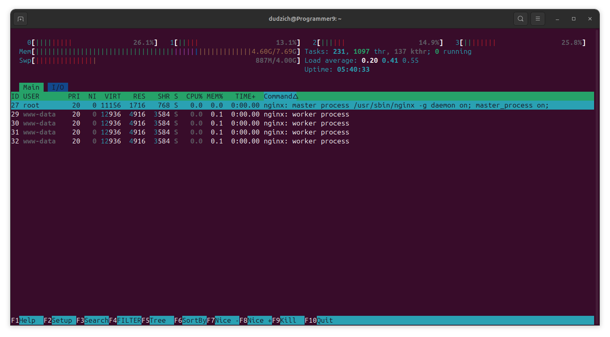

### 1. Vim
Первым делом устанавливаем Vim
```Bash
sudo apt install vim
```
Создаем каталог `practice`, в нем же создаем файл `memo`, используя `vim`:
```Bash
mkdir practice
vim memo
```


Заполняем его предоставленным в задании содержимым:


После всех проделанным из заданий манипуляций файл имеет следующий вид:


Для входа в режим вставки используем `i`, для перехода в командный режим используем `ESC`, для перехода в режим последней строки используем `:`,  для нумерации строк используем параметр `:set number`, для записи и выхода используем параметры `:wq` (write) (quit).

### 2. Nginx

Устанавливаем `Nginx`, запускаем и проверяем статус:
```Bash
sudo apt update
sudo apt install nginx
sudo systemctl start nginx
sudo systemctl status nginx
```


Просматриваем логи в режиме реального времени следующей командой:  
```Bash
tail -f /var/log/nginx/access.log
```
Просматриваем уже записанные в файл логи:
```Bash
cat /var/log/nginx/access.log
```


Лог ошибок проверяем командой:
```Bash
tail -f /var/log/nginx/error.log
```

Через `htop` смотрим нагрузку `nginx` на систему:




### 3. Apache2

Устанавливаем `Apache2`, запускаем и проверяем статус:
```Bash
sudo apt update
sudo apt install apache2
sudo systemctl start apache2
sudo systemctl status apache2
```
При стерте сталкиваемся со следующей проблемой:


Установленный `Nginx` занял порт `80`. Для запуска `Apache2` меняем в конфигах `/etc/apache2/ports.conf` и `/etc/apache2/sites-available/000-default.conf` порт на `8080`.


Устанавливаем `logrotate`:
```Bash
sudo apt install logrotate
```
Создаем католог для логов:
```Bash
sudo mkdir -p /var/log/app
```
Назначаем права для пользователя и группы `www-data` на каталог:
```Bash
sudo chown www-data:www-data /var/log/app
```
Исправляем файл конфигурации `logrotate` для `Apache2`, перезагружаем сам `Apache2` и проверяем результат:


